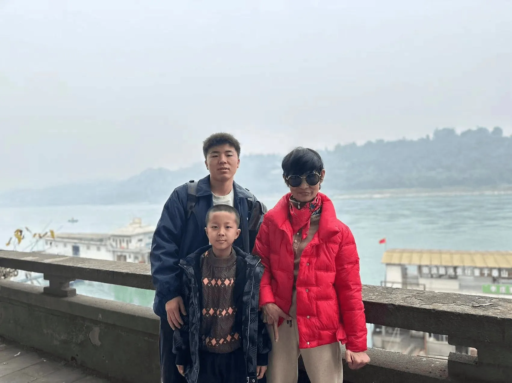

昨天，我的家人自驾从敦煌来到宜宾，记忆中这是我的父母第一次来宜宾，而我的哥哥除了大一开学报道送我过来的时候来过一次之后，这是第二次来宜宾，在这千里之外与家人相见，内心还是比较感慨的。

哥哥在到之前就给我打电话让我找好酒店和吃饭的地方，但是我没有做好接待准备，因为他说要去宜宾市中心，而那里我其实并没有去过几次，我跟同学一般出去玩都是在宜宾大学城这一带，市中心比较远，没有做好迎接工作，被我哥哥一顿吐槽。

感觉大学以后每次见到父母他们都会老去一些，不禁感叹，岁月真的是一把杀猪刀啊~

第二天早上和我姨妈去买早点，姨妈一路上一直说不太习惯四川菜，还说在这里待了三年是苦了我了。其实四川的饭还是很好吃的，当然，前提是吃得习惯。我家在大西北，饮食习惯和四川还是有比较大的差异。不过他们仅仅是过来旅游，所以似乎也不用太在意这个问题。

听了朋友的推荐，去了宜宾的李庄，风景很不错，不过我觉得更适合情侣来往。李庄古镇在长江边，很有江南小镇的感觉，但并不完全是江南风格，毕竟宜宾不在江南核心地带。

李庄比较大，这里也有很多的原住民，一路上拉着焦宇扬拍照，拍得太多，以至于他对拍照都开始抗拒了。

似乎也很久没有和父母拍过合照了，父母年纪大了，是要多让他们享享清福了，多出来走走，看看不一样的世界。我也很佩服我哥哥，两天开车两千多公里，接到他的电话我是很意外的，没想到这么快。

李庄出来后带他们去大学城吃饭，他们一直说我不早点说大学城这边这么好玩，吃喝玩乐都方便，我也是百口莫辩。下次有朋友或者熟人来一定要去大学城，宜宾大学城这边别的不说，起码环境比老城区好一点。

吃完饭后他们要赶路去贵州了，于是把我送回学校。讲实话他们走了之后我一个人回到空荡荡的寝室，心里还是有点难受的，只希望快点忙完回家吧，与父母家人在一起才是真的安心！
