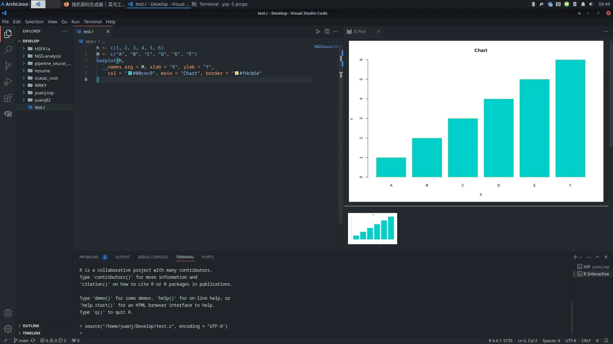

昨天看到余教授在用 xfce4，于是乎，也装来玩玩，整体上还可以，主要有一些细小的问题需要搞一下。

blueman 一直报`Connecting to Bluetooth but Connection Failed: No audio endpoints registered`，搜了下社区，似乎是 bluez 的问题，之前 cinnamon 上一直没问题，换 xfce 不知道怎么了，补一个包就行：

```bash
sudo pacman -S pulseaudio-bluetooth
```

thunar 不能自动挂载 U 盘设备，安装两个包即可：

```bash
sudo pacman -S gvfs gvfs-mtp
```

默认的程序菜单又抽象又不好用，用 whiskermenu：

```bash
sudo pacman -S xfce4-whiskermenu-plugin
```

rime 雾凇拼音：

```bash
yay -S rime-ice-pinyin-git
echo 'patch:' >> ~/.local/share/fcitx5/rime/default.custom.yaml
echo '__include: rime_ice_suggestion:/' >> ~/.local/share/fcitx5/rime/default.custom.yaml
```

候选词修改：

```bash
echo '  "menu/page_size": 10' >> ~/.local/share/fcitx5/rime/default.custom.yaml
```

鼠标光标用`qogir-gtk-theme`主题。

控制栏默认是没有音量控制的，需要多装一个包：

```bash
yay -S xfce4-pulseaudio-plugin
```

VScode+httpgd 出图还是很丝滑。



整体感觉还算可以。


