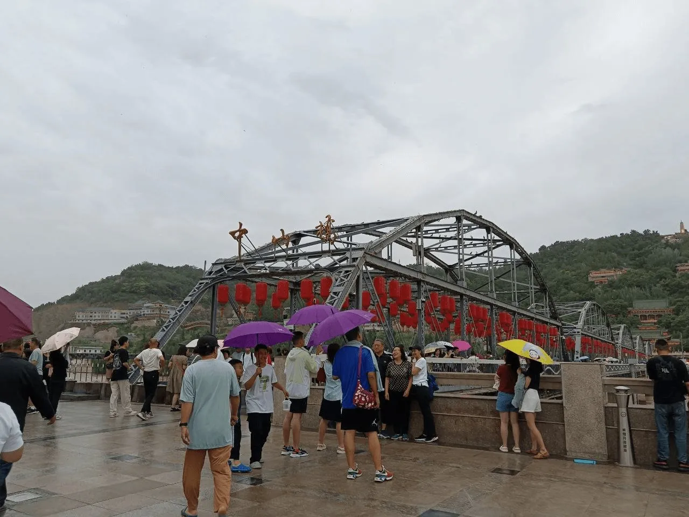
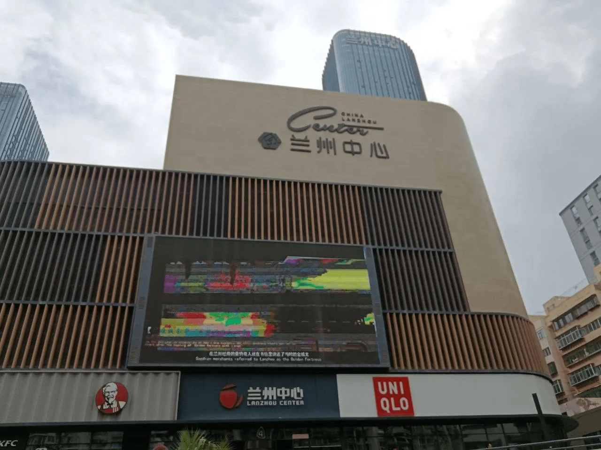
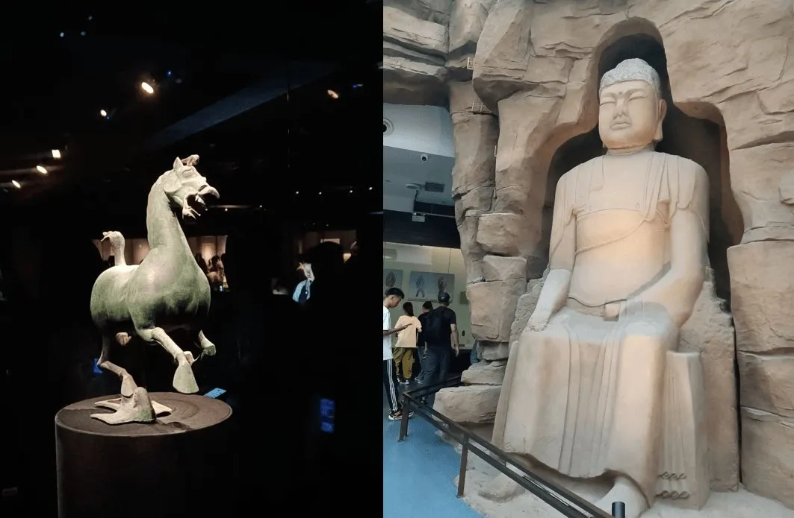

本来决定不回家，呆在学校复习，但学校假期买东西、吃饭不太方便，所以改变主意，打算回家到乡里复习。

有个好朋友这段时间正和他女朋友在兰州暂住，另有一位好友在兰大读书，所以这次到兰州后玩了两天才回敦煌。之前来过兰州很多次，都是住一晚或转车经过。

到兰州的当天，自然是和朋友一起吃饭喝酒了。现在我尽量少喝酒，酒伤身，喝多了脑子糊涂，我不喜欢这种感觉，所以只喝了一点点啤酒。

跟这些从小一起长大的朋友在一起还是很轻松的，毕竟知根知底，互相什么都清楚，也就完全放得开。

第二天就和兰大的朋友一起转悠了，先是去了兰大的城关校区，感觉还蛮不错，毕竟也是 985，实验室和医院挺多的，但是建筑都比较常规，也就没有拍什么照片。完事又顺路去了中山桥，看了看黄河，来兰州中山桥打卡几乎是必须的。

这俩地方都在城关区，地铁坐个四五站就到了，还是很方便的。别了中山桥之后就到晚上了，我们闲来无事，就去了兰大门口的网吧打瓦🤣宿舍里的台式装了 Arch，而且学校里也比较忙，就没怎么玩，这会正好有时间，自然得狠狠开一波黑了。

第三天去了兰州中心逛街和吃饭，兰州中心实际上就是一个商场吧，跟宜宾的万象汇、万达，成都的环球中心那些实际上差别不大（个人感觉），只是规模和种类上有区别。

出了兰州中心，对面就是甘肃省博物馆，我已经提前预约了，所以就直接进去参观。看了一圈感觉其实和很多博物馆相似，比如地球起源、古生物进化、红色革命等大多博物馆都有的内容，但甘肃省博物馆有丝绸之路展、佛教展和马踏飞燕等特色展项，其中丝绸之路与马踏飞燕颇具特色。马踏飞燕以前只在课本上见过，这次终于见到了；佛教的一些器物和佛像也挺不错（阿弥陀佛）。

总体来说对兰州的印象一般，城关区的卫生确实差强人意，中山桥和兰州中心人满为患，甘肃省博物馆馆内部分环境也不太理想，到处有灰尘，许多地方有细碎垃圾。

第三天的下午就坐上火车回家了~

昨天早上到敦煌，到了之后立马先来一盘美味的过油肉拌面，想这口很久了，我一直很喜欢吃面，包括拌面、炒面、鸡汤面、浆水面、拉面等等，走过这么多地方，还是敦煌和西安的面最有味道，可能是吃习惯了吧，兰州的面馆非常多，但是味道好的真不多，也有很多清真的，总感觉口味不太喜欢。四川的面都是面条，几乎没什么手工面，大都是面条煮好之后放上汤菜，我不太喜欢这样的，感觉味道不好，手工面才是最香的。西安的驴蹄子面和油泼面都很不错，我很喜欢，在兰州中心吃饭时，遇到一家西安油泼面，本想去吃，奈何人太多，实在等不到。

来的火车上邻座好几个人听说都是来敦煌旅游的，不禁感叹，大美敦煌魅力真大啊——要知道，我坐的是 13 小时的硬座啊！