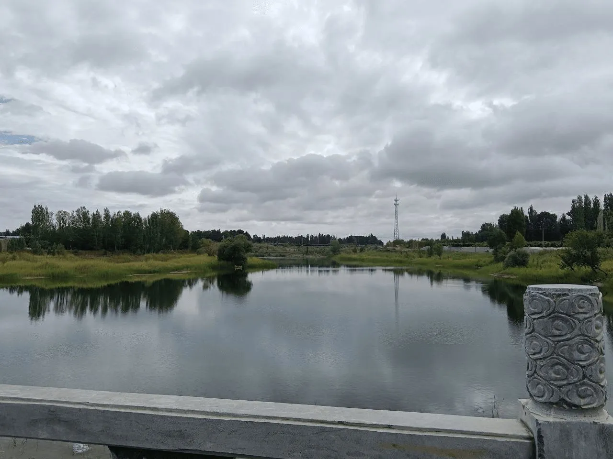

现在在火车上，从敦煌往南走的路上网络信号不好，经常没有覆盖。于是我会下点单机游戏或电影在路上打发时间。今天把一直想写的这篇博客写完。构思时会想到很多，但动笔时常常词穷。

在乡下呆了差不多一个月，感触很深。最明显的是一些“大人”变老了，身体也越来越差，包括我的父母。以前见过的小朋友也都长大了，隔壁的小女孩上次还在幼儿园，如今已是亭亭玉立的初中生。每天晚上九点后我去附近的篮球场打球，遇到很多老朋友和一些小孩。打球时我常说：“上次见你还那么小，现在都能和我一起打篮球了。”

## 故人

许多“大人”见到我都会惊叹：“你都长这么高了，是不是快毕业了？”而和我年龄相仿或比我小几岁的人则常说我一点都没变🤣。这次回来，对我意义很大的一件事是回乡前一天与初恋见面。她说我们认识九年了，第一次相遇时我才上初一。那时我什么都不懂，但很确定自己是真心喜欢她。现在年龄大了，似懂非懂，反而不太清楚真正的喜欢是什么。

我们吃了顿饭，饭后在河边散步，像多年未见的老友一样聊了很多：未来的打算、这些年的变化、身边的朋友。上次见面还是高中二年级，转眼五年过去了。见面前她担心会不会尴尬，但我们从下午聊到晚上，完全不像陌生人。尽管如此，我想以后大概不会再有交集——我把对她的喜欢留在过去，不想看到多年后变得陌生。

在乡下转了很多以前常去的地方，许多地方已换了模样，似乎只有黄昏没变。

## 父亲母亲

自上大学后，每次回家都能感到父母又老了一些。我希望多陪他们，多说说话。在老相册里看到他们二十多年前的照片，那时他们很年轻，看到照片有点想哭。时间在他们的轮廓上留下了痕迹。

我的父亲耳朵不好，话不多；母亲话相对多一些。他们没学太多文化，只知道些口耳相传的老话。自我上大学后，几乎每隔几天就打电话回家，父母不厌其烦地重复那些简单的问题：下午吃了什么？那边天气怎样？现在天黑了吗？今天上了什么课？越伟大的爱越是无言，他们的关心我都记在心里。

在家的时候，母亲多次说如果不行就回敦煌跟我哥哥做导游，自己养活自己，安稳生活。可我还是想拼一次，母亲便默默支持。我有几个上大专的朋友已经在家乡定居，有的买了二手车，能带父母出去旅游。听侄儿说“要你好好考研，考不上就回敦煌”，听到这话心里有点酸，但我选择继续走自己的路。

## 在错误中学习

在“生信爱好者周刊”看到一句话：在错误中学习。很有道理。我过去学得最好的一些东西，都是从试错中摸索出来的，这也让我更清楚问题所在。

## 为生活做减法

时代发展太快，需要关注的事越来越多。手机里的通知和信息流让人难以把时间留给真正重要的事。考研期间我发现，累了想放松时常被大量低质信息打扰。于是我开始追求更简单的生活，保留真正需要的事物，舍弃多余的。

我控制手机 APP 数量，经常清理不常用的物品，把常用的东西放手边，其余装盒收藏。写作上我用 markdown + git，同步与备份都很简洁。信息获取我偏向主动，用 RSS 订阅喜欢的个人博客，减少算法推荐带来的干扰。

系统方面我用了 Arch Linux，配置精简，工作流固定。日常写脚本（R、shell、Python、C/C++），用 VScode 和终端处理大部分工作。对我来说，这样的环境更纯粹，也更高效。

## 主动获取信息

信息化时代我们越来越被动接受信息。算法推荐占据许多页面，我越来越讨厌这种方式。相反，我更喜欢主动获取。RSS 仍然是我最信任的信息渠道：只订阅那些真正想看的源，保持信息的纯净。

## 努力

考研很艰苦。我想只要每天坚持学习，考完之前都不放弃，过程本身的意义就会很大。愿大家共勉，在时代的汪洋中找到各自的彼岸。