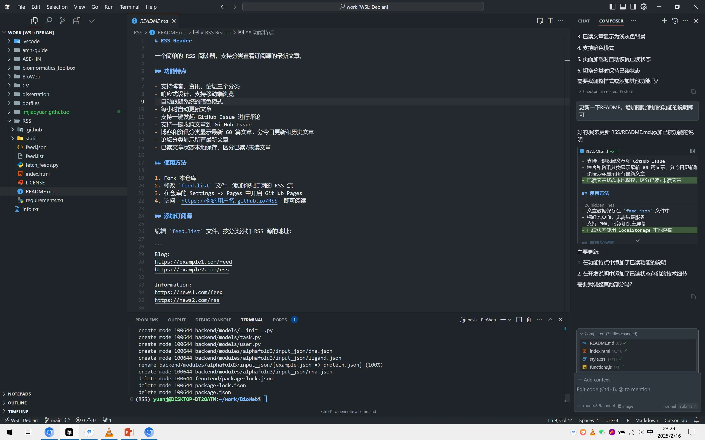
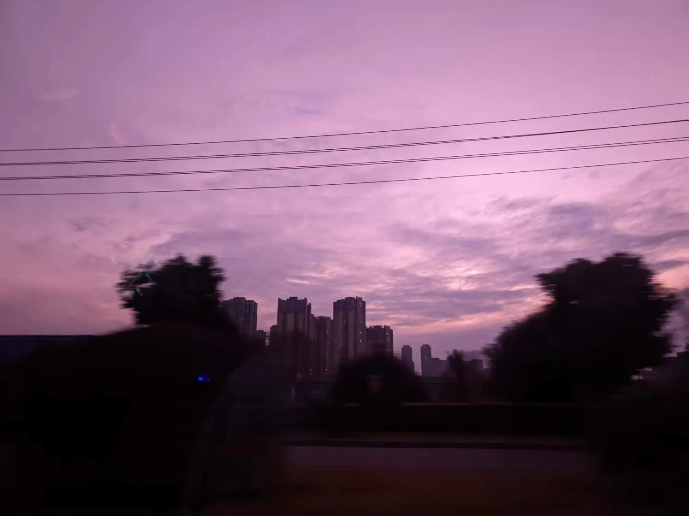

本来此文是在敦煌返回成都的列车上写的，但是回成都后一系列事情搞得人身心俱疲，所以一直在拖，今天下午六点睡到九点多，想着把这些拖延的事情收个尾。

## 流水账

考完研后在学校里无聊了十多天，这段日子的反差感是真的大，每天都要跟室友说几句"好无聊啊，已经不知道玩什么了"，考研之前总在想着考完后要做点什么什么，真正考完后倒没什么很想做的事了。每天就是玩手机玩电脑一直循环，接了农科院师兄的一些分析，也基本每天就写好脚本挂在集群上面跑。后面考完试就到成都开始进行毕业论文相关的事，我做的是机器学习，湿实验跟着师兄一早上就过了一遍，随后便是一些数据的下载、处理与分析。师兄带着我跑了一遍随机森林，我自己又跑了一遍 XGBoost，主体部分差不多了，后续就是多跑几种算法再进行结果分析。也临近去科伦实习的日子，提着行李箱慢悠悠到温江办了入职。我属于转化医学中心、转化科学部、生物信息组，直属领导是一位南方医科大学的博士，我的主要工作是使用 Vue 和 Flask 开发一个 Web 应用，对接 AlphaFold3 等一系列生物大模型，使用户能够通过简单的 GUI 进行模拟与分析任务，算是全栈开发。

在此之前我是没有接触过这么大型的项目的，甚至 Vue 都没有用过，只能自己现在公司发的电脑上部署开发环境，自己先试着开了个小的项目，搞清楚 Vue 与 flask 之间的路由关系，随后便风风火火的开干了，得益于 AI 的加持，进度还算不错，目前 AlphaFold3 功能已趋近完善，又开发了任务管理、用户、通知、错误反馈等模块。公司的堡垒机只能用网页 RDP，22 和 443 端口被封了，不太方便；公司发的笔记本性能也偏低，本地调试慢。

过年回家的前一天，我在京东用国补买了一加 Ace5。系统自带的 ColorOS 15 体验一般，自带不少垃圾软件。初六按 XDA 教程解锁了 BL，刷成了国际版的 OxygenOS，带谷歌套件，纯净无广告，非常舒服。再用 adb 删掉不需要的软件，达到了理想的安卓状态，目前只发现自带相机应用偶尔卡死，其他没问题。

过年在家的日子实在是平常，每天就是睡到自然醒后，吃完饭就去玩，这些年已经不是很喜欢去走亲戚了，因为基本上和大人们没什么话题，基本上就是吃完饭就坐在那玩手机了，所以走亲戚能不去我就不去。然后就是和各种朋友聚餐、喝酒、打球，不得不说，是不是年龄大了，压根喝不动，喝几杯就难受，不过跟朋友在一起的日子还真是开心，大家一起聊聊天，吹吹牛，时间就过去了。

当然，也少不了带娃，许久不见，小伙子长高了很多，不过还是一样的黏我，成天缠着我跟他玩。

## 关于 AI

因为目前工作本身做的就是 AI 相关的，所以对 AI 还算比较关注，Deepseek（简称 DS）凭借强推理能力在过年火速出圈，我几个月前就开始用，包括实习期间辅助写代码。起初没觉得突出，但当 DS 服务器繁忙时我转用 GPT，发现 GPT-4 的推理不如 DS，很多问题回答不上，而 DS 回答详细且准确。Deepseek 服务器繁忙确实影响体验。有人在 YouTube 测试，发现遇到某些关键词时 DS 会给出“官方回答”，也有博主分享“越狱”教程可绕过限制，但我没有相关硬件条件就没试。另有小道消息说 OpenAI 的模型并不比 DS 差，只是逐步放出能力；DS 的表现可能促使 OpenAI 加快更新。

生物大模型相关的目前了解的不多，目前主要还是在开发 AlphaFold3 的 Web 应用，后续会接触到一些模型开发工作，届时再去慢慢了解吧。

最近用了 Cursor，交互体验很惊艳，原生交互比 VS 上的扩展好很多。不过每月 20 美元对我不便宜，因此先用临时邮箱等方式试用。已经向博士申请公司订阅，估计很快就能用上。

## 关于我

考研期间，大半年没怎么运动，导致体型走样，身体素质变差，到温江开始实习后，晚上有时间都会去跑步，绕着前面的一片园区跑一圈，大约 40 分钟，五六公里的样子，感觉身体素质慢慢走回了正规，不过体重还是没有下来，后面打算狠狠心，调整一下饮食，争取再瘦 10 斤。可能也是习惯了这边的生活，现在感觉每天都有事情要做，也不会经常去想一些有的没的，正如 CS 里 CT 阵营的一句台词所说："丢掉幻想，准备战斗"。也做了好几次梦，梦到我的考研成绩，时好时坏，现在我也不去想，到时候自有分晓。

## 关于未来

我其实还没有具体想过，如果考研失利我该如何？我只是想着，可以在科伦先留下来，边工作边二战，但是还没有决定。实际对我而言，只要过了国家线，能调剂到一个差不多的学校，我也愿意读，我不想二战，实在太痛苦了，感觉一战已经耗尽了我的精力，所以不到万不得已，我是绝不会二战的。不过我还是很庆幸，走上了生信+AI 的这条路，这比环境科学与工程好了太多太多，并且我自己也感兴趣，所以我觉得，如果考上了，我再奋斗几年，应该还是能够做出一些事情的。