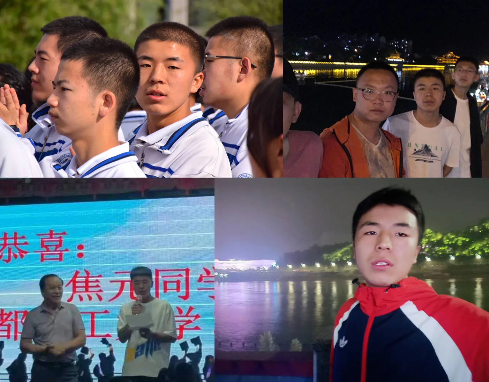
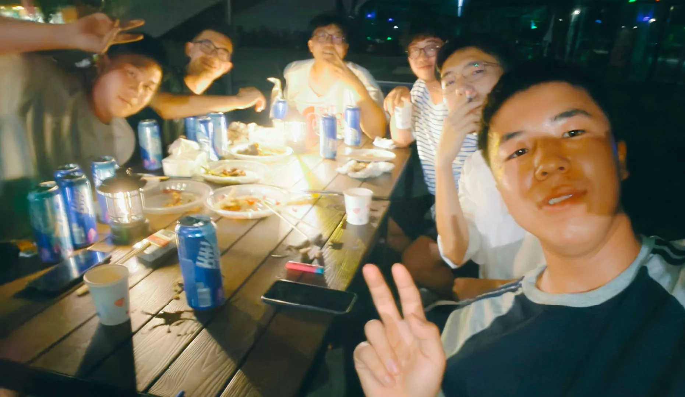
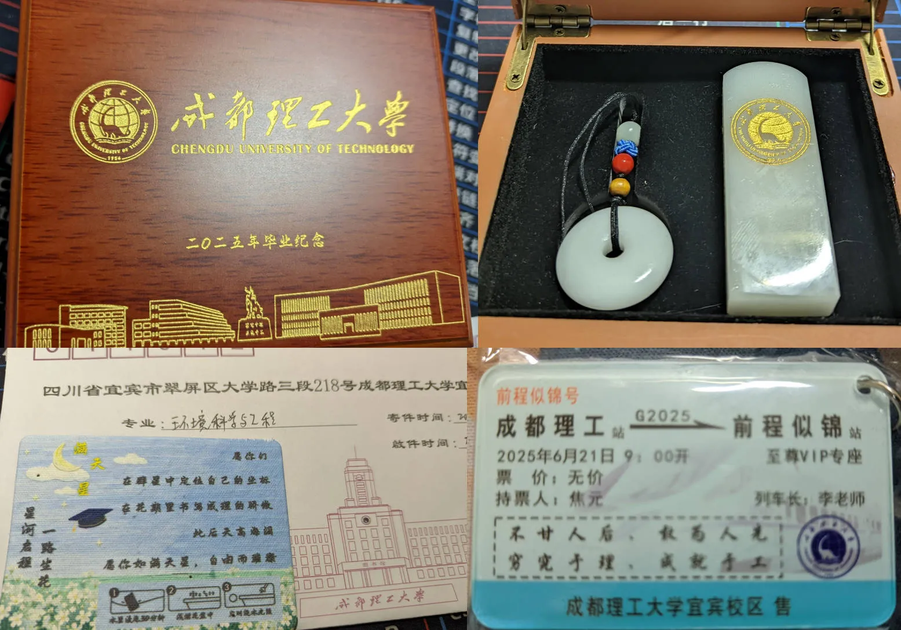
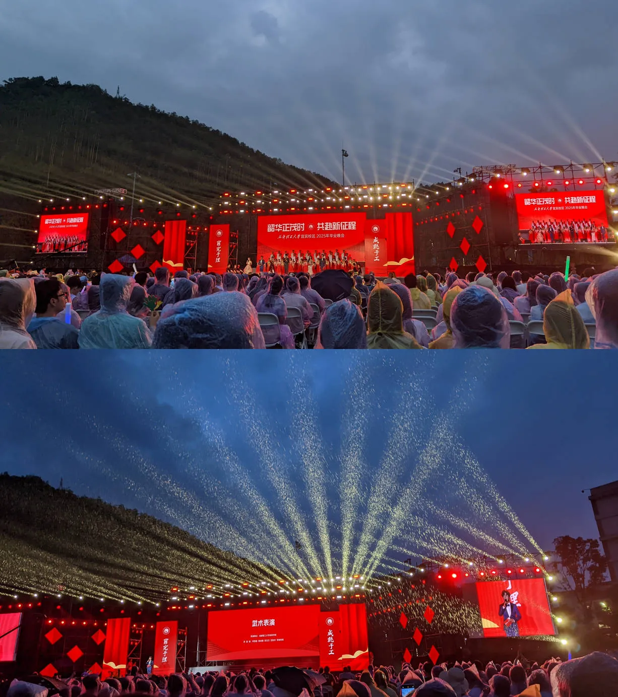
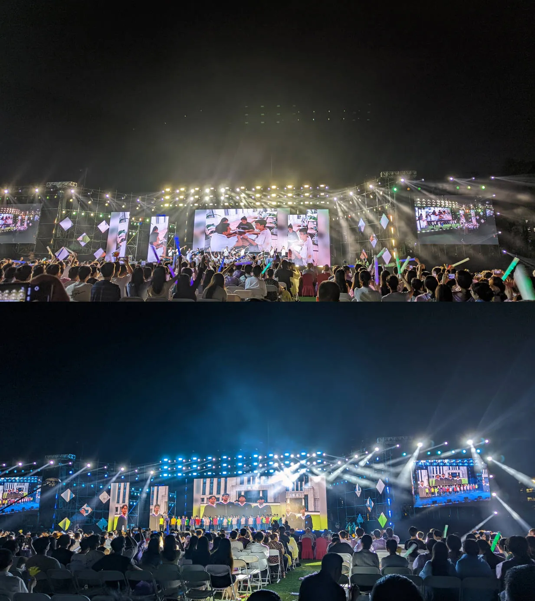
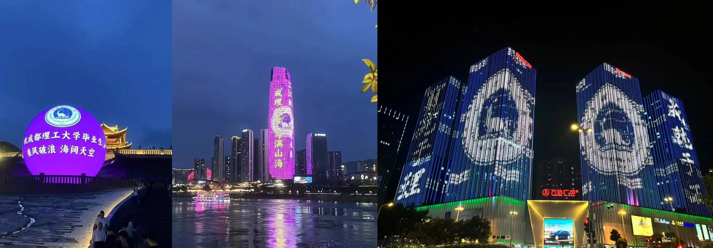
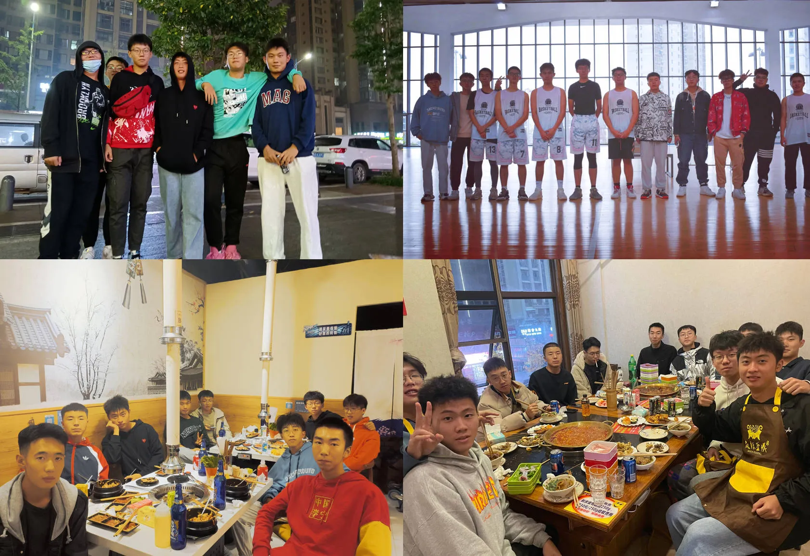

窗外的蝉鸣渐弱，阳光依旧炙热，但我知道，这个盛夏终将逝去，就像2021年的那个夏天一样，再也回不去了。

## 毕业快乐

这一个多月以来基本上一直都在忙活毕业相关的事情，赶了几天的毕业论文和答辩，虽然答辩的时候也有没有回答好的问题，但是总的来说还是很顺利的，答辩结束后去拍了毕业照。这一身黑袍穿在身上的时候着实是没多大感觉，虽披上学士袍，但我们都明白，这四年留下的痕迹，或许比想象中更浅。拍专业合照时，恍惚回到大一报到那天——同样的地点，同样的人群，连快门声都如出一辙，不同的是，今后我们的路不一样了。回顾这四年的点点滴滴，虽然夹杂着许多痛苦，但是总体上还是非常快乐的。

专业合照拍完之后，又和比较熟悉的朋友拍了合照，虽然这么多年一起拍了不少照片，但是这“最后的合照”还是很特别的，大家都清楚，此后可能并没有多少机会可以再聚在一起了。

可能是年纪比较大了的原因，虽然心里充满了惆怅，但是除了嘴上说几句“唉，毕业了”，其余的时候似乎还是依旧按部就班，做着自己该做的事。那几天也正是高考的时候，前三年我压根没有关注过高考，今年似乎注定不一样，总是会想起 2021 年高考的时候，同样是毕业季，同样面临着升学，也同样的意气奋发，但是似乎又不太一样，总觉得这个盛夏的阳光比当年更加刺眼，使得我们的眼神再也没有那么清澈。

说起来也真是的，在宜宾呆了四年，现在才发现宜宾好多地方都没有去过 ... 去年家人来四川的时候才去的李庄，快要走了才去看了合江门和宜宾博物院。也是毕业了才开始觉得，宜宾也真是个不错的地方。我们也再一次去了水幕广场踏水，上次还是大一实习的时候，过了三年，我们都发生或多或少的变化，而长江还是那么壮丽，我贪恋这种无拘无束的片刻，像风掠过江面，不留痕迹却刻进记忆。

在很寻常的一个日子里，我还在网吧打游戏，突然被朋友打电话叫回学校，说是在学校新开的烧烤吃点东西，喝点啤酒，都已经忘了有多久没有在学校里喝酒了。上一次似乎还是大一的时候我室友过生日，因为疫情不能出学校，我们在宿舍交流室给他过的，我们当时给他买了 JK，今天他走的时候，那套JK制服被他郑重地塞进行李箱，成了四年荒唐青春最鲜活的证物。🤣

这天聊了很多，都在感慨时间的无情，感觉才刚熟悉，就到了分别的时候，大家也都在说那句老生常谈的“毕业了一定要多聚聚”。

毕业晚会这天，收到了学校和辅导员发的纪念品，还是很精致的。

毕业晚会也很嗨，虽然途中下了雨，但是在这盛夏，这场及时雨无疑是锦上添花，让毕业晚会的火热氛围更上一层楼。看着台上的同学展示着自己的才艺，让我也有点遗憾，当初也该发展一些艺术类的爱好的。毕业晚会上，辅导员、保安、宿管阿姨、保洁阿姨、食堂人员都有上场，也放了很多专业的照片，还有全场合唱，应该是我大学四年参加过最有意思的活动。最后的压轴歌曲是我朋友主唱的，我们一直感觉是降维打击，他唱的太好了，唱到人的心坎里去了，要不是太了解他，我们都会怀疑是请来的专业歌手了。

不仅如此，毕业晚会的牌面也是拉满了，在同一天，宜宾长江之珠、宜宾中心、成都金牛万达广场都在播放成理灯光秀。

总归是要说再见的，毕业晚会结束后，就到了离别的时候，由于我还有一门考试，必须要待到七月份，所以我就成了最后一天离开的。今天最后一个朋友也走了，四年的本科生活过的是如此的快，这两天的心情比较低落，看着空荡荡的宿舍，不禁想到，我们走后，这里又会是谁的四年？

## 又见黄老师

前几天，以前参赛的同学喊我去成都，请黄老师吃顿饭，毕竟这一走不知道就到多久才能再聚。我们四个人，一个南京大学，一个浙江大学，一个四川大学，一个广州大学，说起来也算是顶峰又见了🤣

黄老师虽然也会收环境科学与工程的学生，但是主要的方向其实还是在生物，而我们几个也只有我是跨到生物了，所以和黄老师也聊的很多。我一直视黄老师为我的伯乐，要不是跟着他做课题，我估计也不会走到生信这条路上来。不过我也还在成都，以后也还有机会再见的。当初也是黄老师推荐我来川大生信的，他对我几乎可以说是倾囊相授了，之前写过的文章里面已经感谢过很多次，还是道不尽感激之情。

结束后回去的路上，黄老师送我回去，路上聊了很多，聊我的研究方向，聊我的研究生导师，聊我的未来规划，每次和黄老师聊天都能让我受益颇深，这次也不例外。说起来也是，我记得大三的时候还在跟着黄老师做组学，但是感觉已经过去了很久，可能这就是时间的可怕之处吧。

## 大学

要我自己看来，我的大学生活是无比丰富的，很开心的四年，去了很多地方，认识了很多不同的朋友，学到了值得我终身努力的东西。有人问我，我大学四年都干了些什么？仔细想了想，大一的时候，只知道谈恋爱，和朋友吃喝玩乐，一有空就去打球，肆意释放着被高中学习压抑的个性。我妈总说我像是野生的，总是玩的不着家，大二后疫情加重，我在家呆了半年，却变得恋家，俗话说得好，金窝银窝不如自己的狗窝，我的家虽然不能称得上是个完美的家，但却是我最珍视的，我深深爱着这个家。疫情结束后我要回学校了，虽然离开了家，但是我明白了，或许我对于这个世界来说轻如鸿毛，但是有人爱着我，这也给了我莫大的勇气和毅力去度过遇到的一个又一个难关。大二开始，我意外进入黄老师课题组，参加比赛、做课题，花费了很多的时间和精力，虽然拿了奖，有了论文，但在我看来这些一点都不重要，真正重要的是，我发现了我真正所热爱的事业，并且我也在这条道路上一直前行。我一直觉得，兴趣是最好的老师，我对这个方向感兴趣，不需要别人的督促，我就能自己一直不断学习，不断提升自己。当初考研面试的时候，有个教授问我，你本来的专业是环境科学与工程，生物信息学与你的本专业可以说没有任何关联，你是怎么想着到这个方向来的？我回答她，我对这个方向很感兴趣，我花了很多时间来学习相关的东西，由于我们学校没有相关专业的老师，可以说我几乎是纯自学，但是我依旧坚持下来了，这些经历也给了我莫大的自信，让我能够解决一个又一个难题，这是很难能可贵的。随后大三考研，我没有丝毫犹豫，只想考这个方向，我也有信心可以做好，就目前来看，我并没有让自己失望。

我觉得，大学，不能单单用成绩来评判你是否成功，有的人致力于提升成绩，有的人热衷于参加活动，提高自己的社交能力，结识不同的朋友，有的人在自己喜欢的领域发光发热，有的人喜欢篮球，便将时间花在打篮球上面，有的人喜欢唱歌，就努力去参加各种相关活动，这些都是成功，这也才是大学的真谛。

## 时间碎片

这些零散的片段，终将和2021年的夏天一样，被封存在记忆的琥珀里。而未来的路，正像这个盛夏的阳光——耀眼到刺目，却让人忍不住抬头向前。

> 宿舍钥匙交还楼管时，他撕下登记表上我们那一页，随手扔进“2025届”的纸箱。 
> 
> 箱子里厚厚一叠纸，每一张都曾是一个盛夏。  

## 文字
- [The last six months in LLMs, illustrated by pelicans on bicycles](https://simonwillison.net/2025/Jun/6/six-months-in-llms/)
- [Ubuntu 25.10 drops support for GNOME on Xorg](https://discourse.ubuntu.com/t/ubuntu-25-10-drops-support-for-gnome-on-xorg/62538)
- [Linux Deepin 团队成员王勇访谈实录](https://www.deepin.org/zh/interview-with-andy-stewart-from-linux-deepin-team/)
- [为什么我，一个从 DOS 时代走来的电脑老用户，也放弃了 Linux 桌面系统](https://www.v2ex.com/t/1137392)
- [什么是博士？](https://www.ruanyifeng.com/blog/2010/08/illustrated_guide_to_a_phd.html)

## 观影
- 七宗罪：一场阴暗的布道，用尸体书写人性之恶的教科书。
- 莫娣：在颜料与偏见之间，她用扭曲的手画出比常人更完整的灵魂。
- 业余警察（冯巩）：90年代的市井幽默，像褪色的老照片——粗糙却闪着真实的光。
- 蛋炒饭（黄渤）：慢火烹调的不仅是米饭，更是一个傻子对抗时代的温柔哲学。
- 隐入尘烟：土地沉默地见证：最卑微的爱，也能在荒漠里种出麦穗。
- 中式学校：纪律与分数的流水线上，黑板擦不去的，是东西方教育碰撞的火花。
- 和平战士：当体操少年遇见加油站苏格拉底，答案藏在“此刻”的呼吸里。
- [一对父子一瓶酒，半生误解半生求](https://www.youtube.com/watch?v=UOLSvAva7RM)
- [飞跃13000公里，我们抵达了北极的心脏！](https://www.youtube.com/watch?v=vkpmNk8jeh8)

## 音乐
- Little Bit Better - Caleb Hearn, ROSIE
- If Tomorrow It's All Over - Chris James
- blue - yung kai
- Your Song - Luhan
- In the End - Linkin Park
- Wake - Hillsong Young & Free, TAYA
- We Don't Talk Anymore - Charlie Puth, Selena Gomez
- See You Again - Wiz Khalifa, Charlie Puth
- Die For You - The Weeknd
- Call Me Maybe - Carly Rao, Iancan