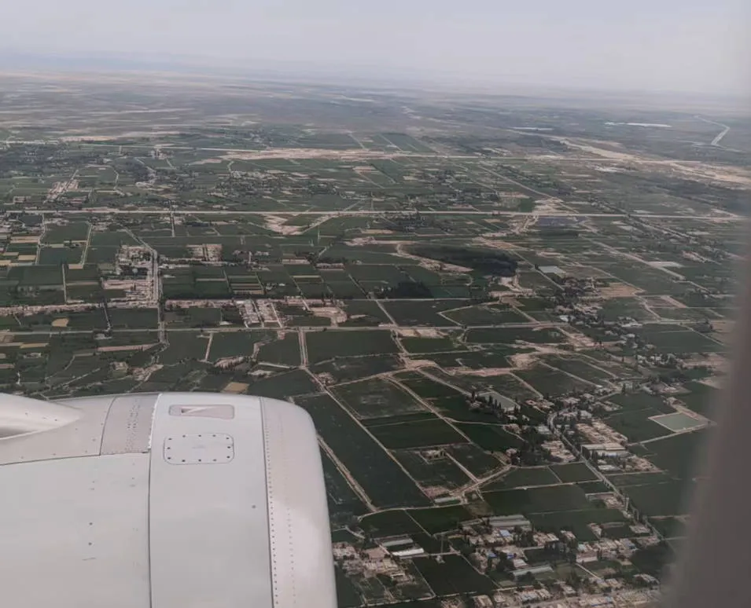
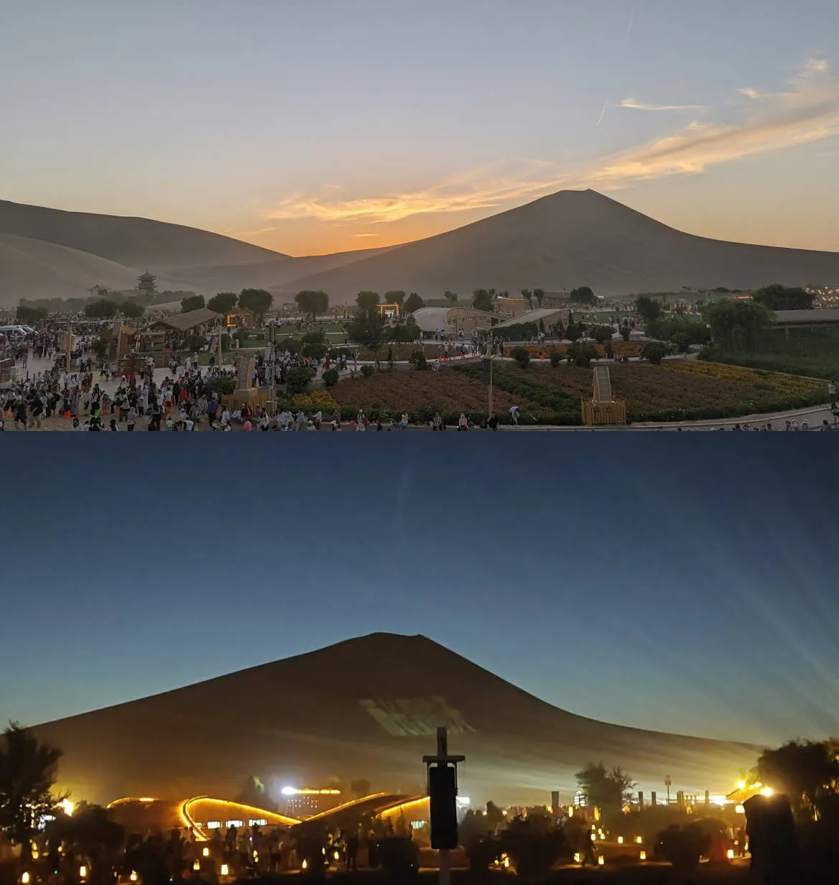
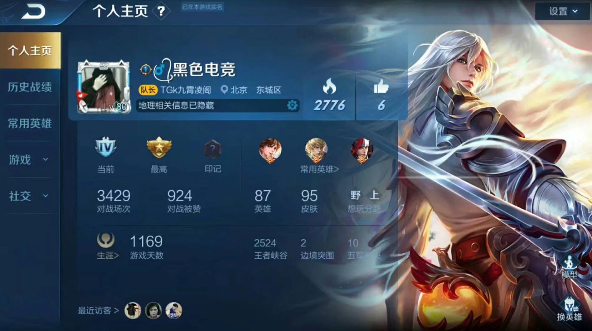

本篇是对 2025 年 6 月至 7 月的记录与思考。

7 月 7 号我结束了最后的重修考试，然后立刻便回了家，没办法，实在太想家，今年只有过年那十天回家了。今年回家是在兰州中川机场转机的，快到的时候，从飞机上望下去，敦煌这边是一片平坦，和四川遍地大山对比还是很明显的。

到家之后我哥请客吃火锅。哎其实还是有些哭笑不得，在四川动不动就是吃火锅，让我很意外的是，近两年我在敦煌吃的火锅感觉并不比四川的差多少，印象中在我高中和大一的时候，在敦煌吃的火锅多数是半成品，很少有鲜切牛肉之类的，不管是自助还是点菜都是如此，想来这两年口味提升了不少。

## 带娃记

回家帮老爹做了几天事，在乡下逛了逛，发现很多地方和我小时候记忆中的都不太一样了，道路修整了，草也长高了。那几天跟我爸那一辈的一些亲戚邻居聊天，都在说，等他们这一辈人老了之后，这里估计就没什么人了，年轻人基本上没有几个回去的，更别提去种地了。不过，乡下的环境还是很好的，也没有那么热。

之后就开始带娃了（我侄子，升五年级），每天的生活也是枯燥且规律，每天给他做饭，规定每天要写的作业，有空就和他打打王者荣耀，带他出去转转，每天他去上补习班的时候我就讲讲考研辅导，然后去健身什么的。突然有点恍惚，好像很久没有这样悠闲松弛了。

很久没有动手做饭了，会做的菜也就那几样，也老是懒得去学新的，就做我们俩爱吃的，反正也饿不着。

有时候不想做饭就去下馆子，在敦煌，我最喜欢吃的就是面食，在四川很少能吃到正宗的手工面条，多数都是机器面条，总觉得不如拉面好吃，最近也吃了不少面，什么牛肉面、炒炮仗、过油肉拌面...抓紧机会吃了，回成都就吃不到了。

## 星空演唱会

前段时间和朋友去了鸣沙山看星空演唱会，据说万人大合唱，很壮观。我去的那天没有明星乐队来，所以并没有网上视频上那么火热，不过也还是挺好玩的，音响放音乐，然后投影把歌词投在鸣沙山山头上，全场一起合唱，十分有意思。如果来旅游的朋友很建议去，不过门票似乎不便宜（本地人免费），而且人很多，检票就排了半个多小时。哦对，记得戴口罩，如果沙子扬起来还是有点难受。这里我拍的不是很清楚。

主持人也很会带动气氛，现场非常嗨。只是到了活动尾声，主持人忙着在广播里帮家长找孩子，没空领唱了，这个小插曲也让人忍俊不禁。后面还有无人机灯光秀，也挺好看的，展示了一些敦煌比较有特色的东西。

## 南京照相馆

最近《南京照相馆》这部电影比较火，我哥点名要我带小孩去看，昨天去看了。它取材于真实历史事件：1938 年 1 月的南京城，在华东照相馆的暗房里，15 岁的学徒罗瑾冲洗日军胶卷时，意外发现了记录日军暴行的画面。这个少年冒着生命危险，秘密加印了这些触目惊心的画面，精选 16 张制成相册，与爱国青年吴旋共同守护这份铁证。

在那个年代，照片记录的都是人生最值得留念的时刻，一张照片往往承载着一个家族的记忆。这部片子角色塑造得挺好，表现了一些法西斯的残忍与狡猾，但并没有过度卖惨或刻意渲染女性屈辱。我就怕变成血腥灼目的片子，这电影在唤起反法西斯与爱国情绪方面做得很到位。稍显遗憾的是，影片中有两处情感升华的转折处理得有些生硬，让我觉得尴尬，但抛开这个小问题，这部影片还是很推荐的。

说起来也有趣，我哥要求小孩看完之后写 600 字观后感，小孩立马不想看了，看到一半就想跑路，被我硬拉着看，结果最后不仅看入神了，甚至抱着我哭了。

## Windows10 快要结束支持了

今天早上在 YouTube 上看到一个视频 [十年过去，Win10 都有什么变化？万字解析 Win10 发展史](https://www.youtube.com/watch?v=TpYLWPqwdnE)，猛然发现，今年 Windows10 要停止支持了。记得我三年级第一次上微机课的时候，学校机房里的电脑还是 1GB 的 Windows XP，初中的时候是 Windows7，高中的学校还是 Windows XP。我家里的电脑是 13 年时候的，也一直是 Windows7，所以我一直对 Windows7 保有极大好感，它的 Aero 特效在当时既美观又流畅，而且资源占用也控制得很好，也很少出现不同版本 UI 共存的现象（参考 Windows10 的控制面板）。现在还有不少地方的电脑仍然是 Windows7。高二的时候，由于要上网课，我一直用我哥的 Windows10 笔记本，那是我第一次用 Windows10，也是从那时候开始到今天，Windows10 陪伴了我六年，它的生命只有十年（2015 年发布），但它陪我度过了很多时光。虽然现在 LTSC 版本还能用几年，但那终究是过去式了。

十年前，微软宣称 Windows10 将是最后一个大版本的 Windows，他不会想到还会推出 Windows11。十年前的我也不会想到我会走到如今的道路上来。时间过去了这么久，我的身份也变了很多次，从小学生、初中生、高中生、大学生再到研究生，不过一直没变的，是我对电子产品和计算机系统的热爱并未消失，反而随着视野提高，这份热情只增不减。我也庆幸能够把兴趣发展为事业。我始终觉得，能拥有一个发自内心的爱好是一件很棒的事，当困难来临时，它或许会成为一味解药。

## 过去的王者荣耀

最近老是在陪小朋友打王者荣耀。说句暴露年龄的话，王者荣耀我也玩了有十年了，我是初一的时候玩的，那时安装包才 200MB，KPL 也刚起步，梦泪韩信偷家是多少人的回忆。以前还没有星耀段位，上王者是一件很难的事，反观现在，列表里王者多得有些夸张。

（找到一张 19 年的截图）

记得最初王者荣耀经常重做英雄是因为抄英雄联盟抄得太狠，版权原因不得不重做。那时候王者荣耀的建模并不精致，但每个英雄都设计得独具特色，辨识度高；现在很多英雄不仔细看分辨不出，皮肤建模虽然更好但千篇一律，让人觉得没意思（也可能是因为长大了）。顺便吐槽现在的匹配机制，什么样的玩家都有，小学生动不动就打字吵架。身边很多从小一起玩的朋友都不怎么玩了，只有一起开黑时才有意思。回想当年初中每周五放学就去别人家门口蹭网打王者，打到手机没电才回家，夏天温暖，冬天手冷到拿不动钥匙。那时总想要家里有 WIFI，有部跑得快的手机是多么美好，现在虽然条件远超当年，却不见得更快乐。也许这就是人生：拥有青春时沉浸其间，失去后才满怀感慨。

## 读《乔布斯传》

> 如果你坐下来静静观察，你会发现自己的心灵有多焦躁，如果你想平静下来，那情况只会更糟，但是时间久了之后总会平静下来，心里就会有空间让你聆听更加微妙的东西--这时候你的直觉就开始发展，你看事情就会更加透彻，也更能感受现实的环境。你的心灵逐渐平静下来，你的视界会极大地延伸。你能看到之前看不到的东西。这是一种修行，你必须不断练习。

记得那应该是初中的时候，我看了电影《史蒂夫·乔布斯》，从那以后，我便被乔布斯的偏执和对完美的极致追求深深吸引，将其视作偶像很久。最近读完他的传记，更是有种找到精神知己的共鸣。这不仅仅是一个企业家的故事，更是一个偏执的艺术家如何用科技作为画笔，重塑世界的故事。乔布斯曾说过：“一旦做到了简洁，你将无所不能。”、“大道至简”——这一理念在他产品里体现得淋漓尽致。他所追求的“简洁”，和“只做好一件事”的 Unix 精神内核是一致的。它不是功能堆砌，而是对用户需求本质的精准提炼。把复杂隐藏于无形之下，让用户感受不到滞涩，这才是简洁的最高境界。

传记里也展现了乔布斯不近人情的一面，但正是这种不容妥协的偏执，才足以对抗平庸的惯性。在这个充斥“差不多就行了”的世界里，他的存在本身就是对平庸的宣战。为了实现一个完美的圆角、一种理想的字体、一次无缝的体验，他可以逼疯所有人，包括他自己。这种精神洁癖在旁人看来疯狂，但在追求极致的道路上，却是不可或缺的燃料。

乔布斯的遗产或许不仅是那些产品，更是一种信念：拥有极致审美和坚定意志的个体，真的可以让世界向他的设想弯曲。天才与疯子或许只有一线之隔，但敢于走那条钢丝的人，本身就已足够迷人。

## 文字

- [Reflections on Palantir](https://nabeelqu.substack.com/p/reflections-on-palantir)
- [Mastering Bioinformatics in the Age of AI: Foundational Skills for the Modern Scientist](https://divingintogeneticsandgenomics.com/post/ai-bioinformatics/)
- [Why haven't biologists cured cancer?](https://www.writingruxandrabio.com/p/why-havent-biologists-cured-cancer)
- [The launch of ChatGPT polluted the world forever, like the first atomic weapons tests](https://www.theregister.com/2025/06/15/ai_model_collapse_pollution/)
- [读《第五项修炼》](https://manateelazycat.github.io/2025/07/01/the-fifth-dig/)
- [为什么不用 Wayland?](https://manateelazycat.github.io/2025/06/28/why-not-use-wayland/)

## 视频

- [為什麼中國必須封掉 Google？](https://www.youtube.com/watch?v=FnGXv0hdlZw)
- [【初代 NeXT】这绝对是乔布斯最离谱的产品。..](https://www.youtube.com/watch?v=whPY5ilI2xg)
- [零下 39 度，我在中国边疆，邂逅了神的自留地](https://www.youtube.com/watch?v=xdQZdRosthE)
- [百看不厌的传世经典，别因一个人的言辞，而忽略了 ta 的内心](https://www.youtube.com/watch?v=lBFMJM60Mv4)
- [上车时期待，同行时投入，下车时释怀](https://www.youtube.com/watch?v=1QN_fUHh15Y)
- [十年过去，Win10 都有什么变化？万字解析 Win10 发展史](https://www.youtube.com/watch?v=TpYLWPqwdnE)

## 音乐

- 花，太阳，彩虹，你 - MAI, NoLabelCrew, 法老，肯迪仔
- 逃学威龙 - 法老
- Mom - 蜡笔小心
- 特别的爱给特别的你 - 伍思凯
- 末班车 - 萧煌奇
- 活着 - Hao Yun
- 如果这就是爱情 - 张靓颖
- 再见 - 张震岳
- 经济舱 - KEY.L 刘聪，Kafe.Hu
- Hey KONG - KEY.L 刘聪
- 願い〜あの頃のキミへ〜 - Negai Anokorono Kimie - MIREI
- That Girl - Olly Murs
- Centuries - Fall Out Boy
- 红花会 - 圣诞夜 (feat. 贝贝，PG ONE, 阿之，丁飞 & ...) - FirePanda
- Lover Boy 88 - 88rising, Phum Viphurit, Higher Brothers
- Storm - Higher Brothers, HARIKIRI