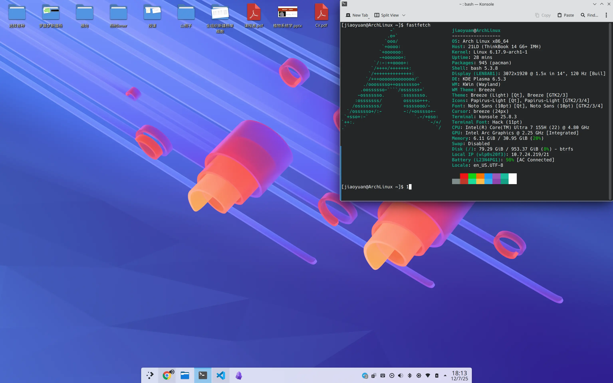

最近还是把笔记本刷了 Arch，感觉就是爽，滚起来不讲道理。之前其实装过几次，但是总有大大小小的问题无法解决，所以用 Windows 先凑合着，这次边用边查，解决了不少以前的问题。现在不用 X11+cinnamon 了，换成 Wayland+plasma 了，整数倍缩放很流畅。这里需要注意，逻辑像素和物理像素需要是简单整数比，不然很多应用动画会有问题。



安装的总体过程和之前写的 [Arch 安装记录](https://jiaoyuan.org/posts/2024-03-20-arch-installation-notes/) 基本上一致，不过我作了一些调整。

## systemd-boot

把 grub 引导换成了 systemd-boot，这是 systemd 自带的，所以不需要安装，直接开始加引导：

```bash
bootctl install
```

然后配置加载器：

```bash
nano /boot/loader/loader.conf
```
```bash
default arch.conf
timeout 0
console-mode max
editor no
```

最后创建启动项 (Entries)：

```bash
nano /boot/loader/entries/arch.conf
```

根据自己的内核和 CPU 微码的类型修改下面几项：

```bash
title   ArchLinux
linux   /vmlinuz-linux
initrd  /intel-ucode.img
initrd  /initramfs-linux.img
options root=PARTUUID=9cc6899a-97af-4b9f-9567-93c179cd3bd5 rw rootflags=subvol=@
```

options 这里需要写根分区的 UUID，如果是 btrfs 文件系统，写 PARTUUID 也可以。UUID 需要在 fstab 中查看：

```bash
cat /etc/fstab
```

最后设置自动更新 (Pacman Hook)，让 systemd 每次更新后自动把最新的引导程序复制到 EFI 分区：

```bash
systemctl enable systemd-boot-update.service
```

可以用命令检查配置是不是合法：

```bash
bootctl list
```

输入下面这样的内容：

```bash
[jiaoyuan@ArchLinux ~]$ bootctl list
         type: Boot Loader Specification Type #1 (.conf)
        title: ArchLinux (default) (selected)
           id: arch.conf
       source: /boot//loader/entries/arch.conf (on the EFI System Partition)
        linux: /boot//vmlinuz-linux
       initrd: /boot//intel-ucode.img
               /boot//initramfs-linux.img
      options: root=PARTUUID=9cc6899a-97af-4b9f-9567-93c179cd3bd5 rw rootflags=subvol=@

         type: Automatic
        title: Reboot Into Firmware Interface
           id: auto-reboot-to-firmware-setup
       source: /sys/firmware/efi/efivars/LoaderEntries-4a67b082-0a4c-41cf-b6c7-440b29bb8c4f (on the EFI System Partition)
```

## plasma 桌面

现在主流的桌面环境默认支持 Wayland 就是 GNOME 和 plasma 了，个人其实不太喜欢 GNOME，比较重，反人类设计也有点多。使用下列命令安装基础 plasma 桌面：

```bash
pacman -S plasma-desktop konsole dolphin sddm
```

进入桌面后可能会发现有些 GTK 程序没有被微风主题渲染，需要安装用于桥接样式的包：

```bash
sudo pacman -S breeze-gtk kde-gtk-config
```

系统设置里面可能无法调整屏幕和 Wi-Fi 设置，那就需要补相关的包：

```bash
sudo pacman -S kscreen plasma-nm
```

sddm 默认的样式很丑，如果想在 plasma 设置中调整 sddm 设置需要安装 sddm-kcm：

```bash
sudo pacman -S sddm-kcm
```

sddm 默认情况下即使应用了 plasma 设置，可能字体还是很小，需要设置 HDPI，向`/etc/sddm.conf`中追加下面的内容，其中，`QT_FONT_DPI` 的值为你的 DPI 缩放数值（计算方式是 96 乘以你的缩放比例，比如 150% 缩放则为 144 ）。`QT_SCREEN_SCALE_FACTORS` 的值为你需要的 DPI 缩放比例：

```conf
[General]
GreeterEnvironment=QT_SCREEN_SCALE_FACTORS=1.5,QT_FONT_DPI=144
```

kwallet 可能提示验证错误，需要安装 kwallet-pam：

```bash
sudo pacman -S kwallet-pam
```

## 代理工具

之前一直用 clash-verge-rev，但是 plasma 下总是很卡，所以我换了 v2raya，一直设置不好，既不能成功分流，速度还很慢，然后又换了 daed，其实就是 dae 带了个 Web GUI，我还是挺喜欢这类 Web UI 的应用，很流畅，也很轻量。

dae 是一个高性能的透明代理解决方案，在作用上与 Mihomo、Singbox 等基本相同，均是通过域名、IP、端口、来源地址、目标地址以及规则集等等不同方式，对流量进行分流以及使用代理，从而达到科学上网的目的。但在核心原理上，dae 通过在 Linux 内核中使用 eBPF 实现流量分流拆分与透明代理，允许在网络驱动程序的最早阶段处理数据包。这样可以在将数据包传递给内核协议栈之前进行快速处理，比如丢弃、转发或修改数据包，所以相比其他软件，dae 的直连性能更好，同时也更方便实现国内外流量分流，在效率上更优。

直接使用 pacman 安装 daed：

```bash
sudo pacman -S daed
sudo systemctl enable --now daed
```

然后打开`http://127.0.0.1:2023/`设置密码和订阅就行了。这里我用的谷歌 AI studio 不能用 HK 节点，所以我就新建了群组，把 US 节点全部放进去，然后添加 routing：

```conf
domain(geosite:category-ai-!cn) -> aistudio
```

不得不说，dae 的速度确实快了很多。

## 硬件问题

系统装好之后默认是没有声音的，需要补一个包：

```bash
sudo pacman -S sof-firmware
```

有可能左右声道声音大小不同，可以用 alsamixer 或者 Volume Control 来调整，通过下面的命令安装：

```bash
sudo pacman -S alsa-utils pavucontrol
```

然后重置一下配置：

```bash
systemctl --user stop wireplumber pipewire pipewire-pulse
rm -rf ~/.local/state/wireplumber/
systemctl --user start wireplumber pipewire pipewire-pulse
```

关闭声卡的节能模式，新建`/etc/modprobe.d/alsa-base.conf`:

```bash
options snd_hda_intel power_save=0 power_save_controller=N
```

蓝牙相关包：

```bash
sudo pacman -S bluez bluez-utils bluedevil
```

启动蓝牙服务：

```bash
sudo systemctl enable --now bluetooth
```

intel 核显相关驱动和工具：

```bash
sudo pacman -S intel-media-driver libva-intel-driver libva-utils intel-gpu-tools thermald
```

有的时候网卡连接热点或者酒店 Wi-Fi 的时候经常会断开，可能是 iwlwifi 默认开了省电模式，给它关掉就好了：

```bash
sudo iw dev wlan0 set power_save off
```

连接校园网的时候可能经常会弹出网络连接受限的提示，这是因为 NetworkManager 在连接到网络后会尝试访问一个 Web 服务器，以确定该网络是否需要进行进一步认证，实际上没什么用，在`/etc/NetworkManager/conf.d/20-connectivity.conf`追加下列内容关掉这个设置：

```conf
[connectivity]
enabled=false
```

我使用 tlp 来优化省电策略：

```bash
sudo pacman -S tlp tlp-rdw
```

调整相关服务设置：

```bash
sudo systemctl enable tlp.service
sudo systemctl enable NetworkManager-dispatcher.service
sudo systemctl mask systemd-rfkill.service
sudo systemctl mask systemd-rfkill.socket
```

这里 tlp 可能默认开启性能模式，导致 CPU 稍微占用高一点风扇就会狂转，把 ON AC 的策略改成 balanced 就可以了。

## 中文输入问题

可能会在 Chrome 里面遇到 fcitx5 无法输入中文的问题，先确认设置好环境变量`/etc/environment`：

```conf
INPUT_METHOD=fcitx
GTK_IM_MODULE=fcitx
QT_IM_MODULE=fcitx
XMODIFIERS="@im=fcitx"
SDL_IM_MODULE=fcitx
```

然后在 plasma 的系统设置里 virtual keyboard 选一下 fcitx5，在`~/.config/gtk-3.0/settings.ini`中追加：

```conf
[Settings]
gtk-im-module=fcitx
```

重新注销登录应该就可以了。

## 部分应用窗口没有阴影

比如微信、WPS 和 QQ 都有这个问题，这里参考`wechat`aur 页面的 [解决办法](https://aur.archlinux.org/packages/wechat)，给窗口强制添加 plasma 阴影，然后去掉标题栏就行了。

## 应用列表

- kate: plasma 高级文本编辑器
- kcalc: plasma 计算器
- gwenview: plasma 图片查看器
- okular: plasma 文档/PDF 阅读器
- dragon: 简易视频播放器
- visual-studio-code-bin: 代码编辑器
- scite: 替代 notepad++，使用`font.base=font:consolas,size:11`设置字体
- git: 版本控制
- nodejs: Node.js 运行环境
- npm: Node.js 包管理器
- python-pip: Python 包管理器
- r: R 语言环境
- hugo: 博客框架
- wps-office-365: WPS Office 办公套件
- obsidian: 笔记软件
- google-chrome: 浏览器
- wechat: 微信（带沙箱隔离）
- linuxqq-nt-bwrap: QQ（带沙箱隔离）
- telegram-desktop: Telegram 客户端
- yay: AUR 包管理助手
- timeshift: 系统备份与还原工具
- btop: 命令行资源监控
- fastfetch: 显示系统信息
- ncdu: 命令行磁盘占用分析工具
- steam: Steam 游戏平台
- flameshot：截图工具，时间戳为`%Y%m%d%H%M%S`，拓展名 webp
- dolphin：替代 xftp