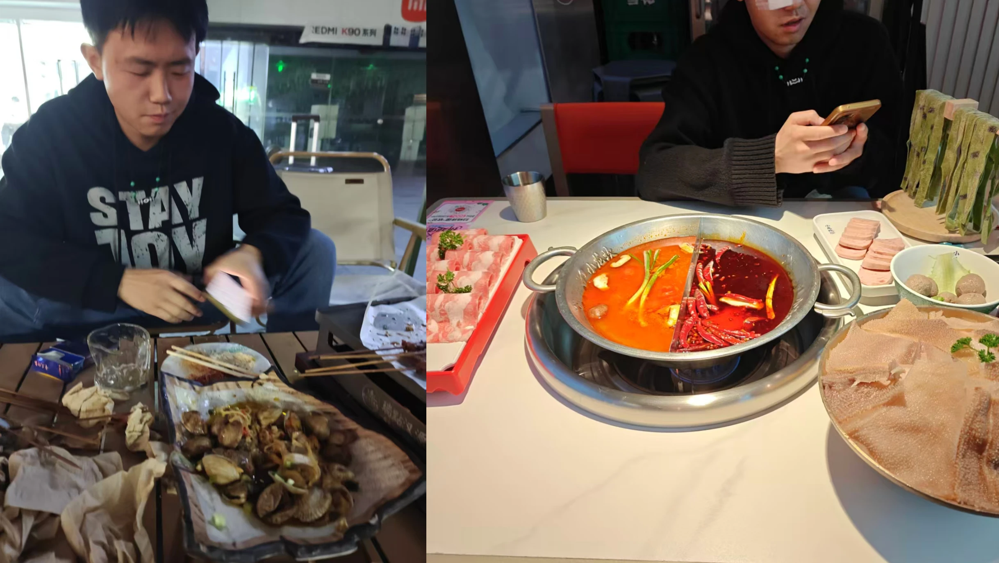
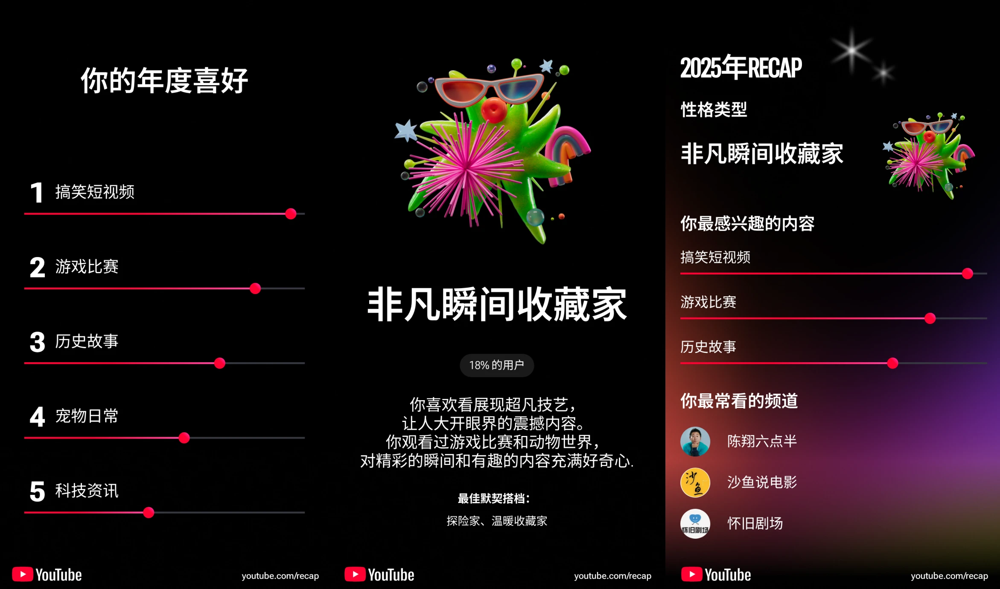
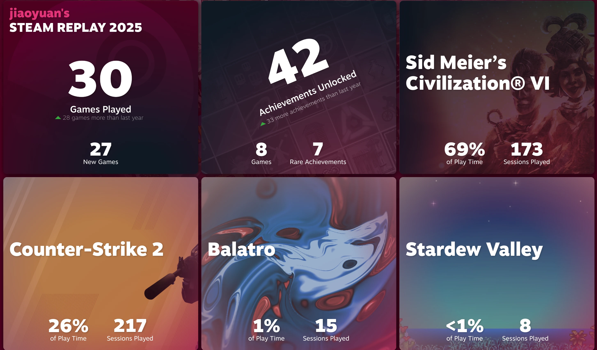
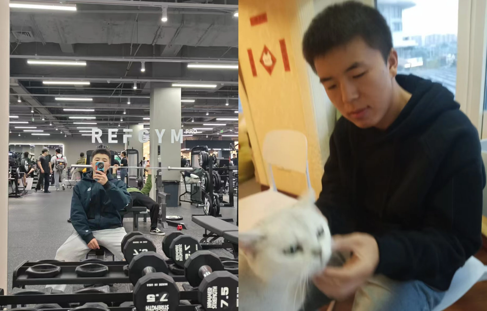

本篇是对 2025 年的思考与总结。

当我打开电脑写下这些文字的时候，成都的银杏已经全然落叶，这里的深冬来得匆忙，与北方截然不同。学校里的草木还是绿色，但是多了一抹阴郁始终压抑在人们的心头，仿佛在警示着人们现在已到了沉寂的时候，只有难得的晴天还能带来些许安慰。按照往年的惯例，我在开头总会抱怨说平时想得多，写的时候却想不到。今年不太一样，时间过的很快，快到我没有意识到一年又要结束了，同时我的 23 岁生日也要到来了。好像总是这样，我们总是会慢慢忽略一些东西进而留出余地来让我们适应快速变化的世界。前两年我没有提到过 AI，因为那个时候 AI 对于大多数人来说还在一个初步发展的阶段，但是今年不同，在 2025 年，AI 是任何行业甚至任何人都无法避开的话题。如果说前两年 AI 是呱呱坠地的婴儿，那 2025 年的 AI 已经是会打酱油的儿童了，无论是谁，无论你是否愿意，你都已经身处 AI 掀起的浪潮之中。

往年写总结的时候我总会打开手机相册，翻看从年初到现在的照片，借此来慢慢回忆这一年的经历，今年的照片似乎比往年都多，今年的经历也比往年多，那今年要写的东西也会更多。

## From ... To ...

今年的我发生了很多变化，年初在温江的实习经历，让我提前窥见了象牙塔外的世界；六月在宜宾，我脱下学士服，正式告别了成都理工大学的本科生涯；九月，我背着行囊来到川大，在这个有着“深厚历史底蕴”的校园里开启了研究生的篇章。从宜宾到成都，不仅是几百公里的路程，更是从稚嫩走向成熟的一段长跑。我不需要在一个让我痛苦的领域里徘徊了。

## 最长的假期

今年的暑假是自高考完以来我最长的假期了，这主要体现在两个方面：一是时间上很长，从 6 月末毕业答辩完其实就算放假了，一直到 9 月 10 号开学，我基本上一直在家，大学以来头一次这么久和家人在一起，日后这样的时间怕是会越来越少了。二是内心感觉每天很长，主要因为这个假期我没做什么具体的事。往年总会做些兼职，这次就结结实实在家带娃，而很多的同学和朋友基本上都有了自己的工作或者事情，也难得一聚了，只能找各自时间的交集，总感觉和朋友在一起的时间很短，没有待够，更多的则是等待。在一起的时候嘴边说的最多的就是以前的事情，谈以前谁做过的丑事，谈以前谁和谁的故事，只能从这些零碎的往事中纪念那些刻骨铭心的记忆 ... 可能这也是人长大都需要面临的困扰吧，想想多年以后在身边的人，与现在相比会有什么不同？人生的过程就像是遗忘的过程

生活的直线难以交叉，让我们也越来越珍惜能和彼此在一起的时间了，以往我总喜欢谈以后，想目光总是放在未来的时间，但是如今变成了乐在当下。前不久老家的朋友突然来了成都，我放下了所有的事情去跟他玩了两天，emm 其实说是玩但是也没有玩什么，只是两个漫无目的的到处乱逛，吃点东西，喝点啤酒，吹吹牛，好像做什么事并不重要，重要的是和什么人做事。

假期基本上都是和小侄子待在一块的，不禁感叹，现在的小孩和我小的时候完全不一样啊 ... 现在的小孩不像我们以前那样内敛沉默，有什么想法会直接说出来，喜欢什么不喜欢什么会直接和大人说，记得我小的时候不管在哪里基本都不怎么说话，只是低头玩自己的，也不会跟爸妈说我想你们了之类的，跟现在的小孩完全不一样。

## 重庆

前段时间忙完之后去了一趟重庆，之前一直说要去，但是都没去成，这下终于有机会去了。重庆确实是一座很奇特的城市，网络上流传的那些打卡景点其实基本都在渝中区，所以凭借 11 路公交，我基本上都去了个遍。大部分的地方其实去逛一逛看一看就可以了，还是比较有特色的。要说最惊艳的还是千厮门大桥和洪崖洞的夜景，我去看了好几次，美的让人不知所以然。特别是站在桥上吹着江风，看对岸层层叠叠的灯光亮起，那种赛博朋克的既视感扑面而来，繁华得有点不真实。

重庆一直为人所称道的除了这些景点之外，还有一个很特别的就是重庆的地铁，哦不对，重庆没有地铁，叫重庆轨道。这玩意儿在这座城市里简直就是过山车，列车有可能出现在任何地方，可能是居民楼，可能是商业街，也可能是江边。记得不错的话是 2 号线，基本上就是沿着江边一直开的，坐在列车里就可以看江景，尤其是一个转弯看到江面波光粼粼的时候，这一点很舒服。除了玩，顺带提一嘴吃的，随便找家路边的老火锅，那个牛油味儿隔着两条街都能闻到，虽然辣得我直哈气，但确实爽。还有个很好的点是重庆地铁的厕所在候车的地方，而成都地铁的厕所都在某个入口，导致有时候想上厕所就要走很久，这一点必须站重庆。

## AI 的冲击

当年 ChatGPT 横空出世的时候，让它写个脚本都写不准确，我记得那时候让它写表达矩阵计算 FPKM，这么简单的计算都写不对，然而现在 Gemini 已经可以做到一次性写脚本操控机器跑完组学全流程分析，并且可以根据不同的需求输出不同的结果，甚至，Gemini 已经可以准确地帮助我修改 Arch Linux 的配置，哪怕 wiki 上没有的东西也可以准确地告诉我，实在是太恐怖了，程序员花了七十年让"写代码"变简单。现在，AI 让"不写代码"成为可能。关于 AI 带来的冲击，在网上已经有很多的讨论：

- [我觉得豆包手机是大势所趋](https://www.v2ex.com/t/1178012#reply64)
- [程序员是最热情拥抱 AI 的群体，也是被 AI 冲击最早的群体](https://v2ex.com/t/1178141)
- [AI 是越来越恐怖了，在互联网领域，那个岗位最不容易取代啊](https://www.v2ex.com/t/1181277)
- [孩子，那不是说明书，那是祈祷文](https://v2ex.com/t/1179965#reply25)
- [AI 淘汰人力渐进 巨变前夕规划应变](https://bm.hkust.edu.hk/zh-cn/school-in-media/2024/02/adapting-workforce-shifts-job-market-triggered-ai-chinese-version-only)
- [AI 工業革命衝擊勞動力市場](https://www.hkubs.hku.hk/tc/research/thought-leadership/ft-chinese-column/impact-of-the-ai-industrial-revolution-on-labor-market/)
- [改变推荐算法排名能改变一个人的政治立场](https://www.solidot.org/story?sid=82914)
- [Generative AI as Seniority-Biased Technological Change: Evidence from U.S. Résumé and Job Posting Data](https://papers.ssrn.com/sol3/papers.cfm?abstract_id=5425555)
- [Blogging in 2025: Screaming into the void](https://askmike.org/articles/blogging-in-2025-screaming-into-the-void/)

下面是我的一些看法：

- AI 让很多以前我们看起来很难的事情，变成了可能。最明显的就是编程了，现在只要你会运行代码，配合上一个不错的 AI，那么你就可以靠自己实现很多的功能。即使你不会，你可以一步步让 AI 教你，AI 像是一个不知道厌烦的老师，它知道所有的事情，它也有无限的耐心解答你的所有问题。再比如翻译，现在 AI 可以将你的句子翻译成任意一种通用语言，并且可以根据你的需求自定义。还有绘画，nano banana 的加持，让任何人可以根据自己的想法画出想要的图片 ... 这样的例子数不胜数。
- AI 改变了传承许多年的教育和学习方式。现在学习很多技能，最快的方式就是和 AI 对话了，说出你不懂得地方，让 AI 用一种你可以听懂的方式给你讲述，并且你可以用什么学什么，不需要特别系统的地去学习技能。教师正从知识的唯一传授者，转向学习的设计师、引导者和激励者。
- AI 几乎杀死了问答网站和搜索引擎，例如 stackoverflow。
- AI 让我们拥有更多地勇气和能力去做我们以前未知的事情。
- AI 加重了信息茧房，当我们不再需要在互联网上主动探索信息，而是直接通过 AI 告诉我们，那么我们也彻底地被困在信息茧房里了，当 AI 根据我们的偏好和过往交互提供“完美定制”的答案时，我们接触对立观点和意外信息的机会将锐减。更严重的是，我们可能无法察觉 AI 输出中存在的隐性偏见或事实错误（“幻觉”）。
- AI 目前几乎已经进入黄金时代，能够阻挡其发展的最重要原因就是算力规模与成本和地缘政治与供应链。

## Linus 老了

前不久看到一个视频 [Building the PERFECT Linux PC with Linus Torvalds](https://www.youtube.com/watch?v=mfv0V1SxbNA),Linus Tech Tips 的 Linus Sebastian 为 Linux 之父 Linus Torvalds 装了一台新的 Linux PC，这台被戏称为“Linux 之父的完美 PC”，配置包括了 AMD 线程撕裂者处理器和 ECC 纠错内存，但显卡的选择出乎许多人意料，他选择了 Intel 锐炫 B580 显卡。借着装机的名义，但是是类似另外一种访谈节目，有一种梦幻联动的感觉。

视频中另一个让我感触颇深的点，是 Linus Torvalds 本人的变化。如今的他已是满头白发，回想起本科时期在书籍和网络视频里看到的那些资料，那时的他还很年轻，意气风发。现在的 Linus 相比记忆中苍老了许多，身形也消瘦了不少，但岁月的沉淀让他那张略显沧桑的脸上多了一份从容与沉稳。看着这位亲手缔造了 Linux 帝国的神明，即便年华老去，依然皓首穷经，在开源世界延续着自己的精神。

## Recap

这些年似乎很流行 Recap 这种形式来回顾用户在各个应用中一年时间的经历，我这里似乎只有 YouTube 和 Steam 有，😅应该是跟我不怎么下载 APP 有关。

看着 YouTube 的年度回顾，它给我贴了个非凡瞬间收藏家的标签，听着挺高大上，其实说白了就是看了不少搞笑短视频和游戏比赛。陈翔六点半和沙鱼说电影成了我的下饭神器，不过科技资讯和历史故事也没落下，看来我还是那个在娱乐之余想稍微长点见识的人。Steam 的记录中，这一年虽然玩了 30 款游戏，但时间几乎都被文明 6 给占了。69% 的游戏时间都在这里，173 次的启动记录，现在回想起来，那一个个重新开始确实让人又爱又恨。除了在文明里指点江山，剩下的大部分精力都给了 CS2，虽然有点菜瘾大的嫌疑，但那种竞技的快感还是很难被替代的。总的来说，2025 年的我在虚拟世界里过得还算充实，既有轻松时刻，也有烧脑的策略博弈。

## 很多时候放弃是最明智的选择

我感觉目前对我来说是最好的时候了，今年通过锻炼和健身，身体素质越来越好了，肌肉越来越多了；心境越来越平稳；在实验室学到越来越多的东西，大脑越来越充实，能力越来越强；家里面也基本相安无事，爸妈身体还不错；哥哥嫂子工作比较顺利，小侄子的学习也算不错，似乎一切都在往好的方向发展。有时候想想，人生不过三万多天，为什么要追求那么多的东西，不累么？似乎道理大家都懂，但是实际可以做到的没几个人。我觉得我自己也是，一直以来，我都太希望追求一种全面的优秀，希望各方面都可以做的很好，在生活、为人处世、感情中做到让人喜欢，在学业和工作中成为老师满意的学生，在家里做孝顺乖巧的儿子和弟弟，但是其实很多时候我做的并不够好，人的精力是有限的，如果我想追求更高层次的人生实现，那么我必须选择舍弃掉某些东西。最近阅读了一篇文章 [A meta-analytic review and conceptual model of the antecedents and outcomes of goal adjustment in response to striving difficulties](https://www.nature.com/articles/s41562-025-02312-4)，据此报道，很多时候放弃其实是最明智的选择，我们可能从儿时起一直被告诫要“坚持下去”，仿佛命悬一线时松手就会死亡，但是实际并不然，很多事情并没有我们想象中的那么重要，只是我们在心理上为这个结果施加了太多的重要性而已，坚持不可能实现的目标会造成严重影响，增加压力、幸福感下降，甚至引发健康问题。放弃旧目标重新转向新目标能恢复目标感和幸福感。

师兄说我从不内耗，但是其实怎么会有人不内耗呢？对我来说我更多的内耗是来自对于自身现状的不满足，以及我没有能力或者能力还没有达到足以实现我预期目标。不过我更多的可能是外耗型，很多时候我并不在意别人对我的看法，上课讲 PPT 我就上去念一念，反正没什么用，水了就水了，至于老师喷我，那就给他喷吧，我又不会掉块肉😂不知道是不是 ENTJ 人格都这样，我另一大特征就是我很喜欢看某件事情对我或者对别人来说“有没有用处”，但是我并不觉得我适合做指挥官，对我来说我做一个类似技术员或者工程师之类的工作会更加让我满意，原因其实也很简单，我只想聚焦于做那些我真正感兴趣的工作，专注做技术方面的突破会更加让我有动力。

现在读研，我最大的痛苦来自应付各式各样的课程。明明对我没什么用，哪怕从不去上课，也不得不花大量时间应付考核，这些被浪费掉的时间我很珍惜，所以我很难受 ... 本科的时候甚至都没有这么多的事情，我只需要考试就行，反而读研了要花费更多时间来解决这些琐事，实在让我有点头痛。

## 阅读

- 《万历十五年》- 黄仁宇
- 《黄金时代》 - 王小波
- [为什么应该尽量避免使用 FakeIP](https://www.srpg.dev/blog/2025/11/28/why-you-should-not-use-fakeip/)
- [建议 Linux 用户尝试下 kvm 虚拟机](https://www.debuggerx.com/2020/11/29/suggest-Linux-users-to-try-kvm-virtual-machine/)
- [全球互联网自由度连续 15 年下降](https://www.solidot.org/story?sid=82826)
- [When Linus Met Linus: Insights from Torvalds’ Conversation with LTT](https://linuxiac.com/when-linus-met-linus-insights-from-torvalds-conversation-with-ltt/)
- [孤灯照大江](https://wangyurui.com/posts/yi-zhan-deng-yi-tiao-jiang-yi-ge-zhuang-yuan-de-e519ebec)
- [Vibe coding 130 万行代码后，我想给每天陪我熬夜的 AI 一个名分](https://www.v2ex.com/t/1177441)
- [Transcriptional landscape of highly lignified poplar stems at single-cell resolution](https://link.springer.com/article/10.1186/s13059-021-02537-2)
- [Single-nucleus transcriptomics revealed auxin-driven mechanisms of wood plasticity to enhance severe drought tolerance in poplar](https://link.springer.com/article/10.1186/s13059-025-03794-1)
- [DeepWheat: predicting the effects of genomic variants on gene expression and regulatory activities across tissues and varieties in wheat using deep learning](https://link.springer.com/article/10.1186/s13059-025-03809-x)
- [The late arrival of domestic cats in China via the Silk Road after 3,500 years of human-leopard cat commensalism](https://www.cell.com/cell-genomics/fulltext/S2666-979X(25)00355-6)

## GitHub

- gkd-kit/gkd: 基于无障碍，高级选择器，订阅规则的自定义屏幕点击安卓应用 | An Android APP with custom screen tapping based on Accessibility, Advanced Selectors, and Subscription Rules
- davialabs/davia: Interactive, editable docs designed for coding agents
- bestruirui/Alle: AI 识别的邮件聚合客户端 | AI Powered Email Aggregation Client
- fastapi/fastapi: FastAPI framework, high performance, easy to learn, fast to code, ready for production
- danforthcenter/plantcv: Plant phenotyping with image analysis
- sansan0/TrendRadar: 🎯 告别信息过载，AI 助你看懂新闻资讯热点，简单的舆情监控分析 - 多平台热点聚合+基于 MCP 的 AI 分析工具。
- xifangczy/cat-catch: 猫抓 浏览器资源嗅探扩展 / cat-catch Browser Resource Sniffing Extension
- Homebrew/brew: 🍺 The missing package manager for macOS (or Linux)
- AlBreeding/DNNGP: DNNGP: Deep neural network for genomic prediction
- usestrix/strix: Open-source AI agents for penetration testing
- zotero-chinese/styles: 中文 CSL 样式 - Zotero 中文社区
- lcalingua-plus-plus/lcalingua-plus-plus: A client for QQ and more. ⚛️
- i486/VxKex: Windows 7 API Extensions
- cyphar/paperback: Paper backup generator suitable for long-term storage.
- calico/basenji: Sequential regulatory activity predictions with deep convolutional neural networks.
- daeuniverse/dae: eBPF-based Linux high-performance transparent proxy solution.
- v2rayA/v2rayA: A web GUI client of Project V which supports VMess, VLESS, SS, SSR, Trojan, Tuic and Juicity protocols. 🚀
- awesome-selfhosted/awesome-selfhosted: A list of Free Software network services and web applications which can be hosted on your own servers
- WtecHtec/WorkNotes: 工具集合、学习记录、
- X11Libre/xserver: XLibre Xserver
- linuxmint/cinnamon: A Linux desktop featuring a traditional layout, built from modern technology and introducing brand new innovative features.
- adityatelange/hugo-PaperMod: A fast, clean, responsive Hugo theme.
- Loyalsoldier/v2ray-rules-dat: 🦄 🎃 👻 V2Ray 路由规则文件加强版，可代替 V2Ray 官方 geoip.dat 和 geosite.dat...
- mzz2017/gg: 一个支持节点与订阅链接的 Linux 命令行代理工具 | A command-line tool for one-click proxy in your research and development without installing v2ray or anything else (only for linux)
- ai-shifu/ChatALL: Concurrently chat with ChatGPT, Bing Chat, Bard, Alpaca, Vicuna, Claude, ChatGLM, MOSS, 讯飞星火，文心一言 and more, discover the best answers
- open-webui/open-webui: User-friendly AI Interface (Supports Ollama, OpenAI API, ...)
- ChaoningZhang/MobileSAM: This is the official code for MobileSAM project that makes SAM lightweight for mobile applications and beyond!
- danny-avila/LibreChat: Enhanced ChatGPT Clone: Features Agents, MCP, DeepSeek, Anthropic, AWS, OpenAI, Responses API...
- SagerNet/sing-box: The universal proxy platform
- ValveSoftware/Proton: Compatibility tool for Steam Play based on Wine and additional components
- topoteretes/cognee: Memory for AI Agents in 6 lines of code
- kavishdevar/librepods: AirPods liberated from Apple's ecosystem.
- mmulet/term.everything: Run any GUI app in the terminal ❗️
- yunmika/PKDP: Prior Knowledge Dual-Path CNN
- andrew/nesbitt.io: Personal blog built with Jekyll and hosted on GitHub Pages.
- net4people/bbs: Forum for discussing Internet censorship circumvention
- bestruirui/octopus: One Hub All LLMs For You | 为个人打造的 LLM API 聚合服务
- jgraph/drawio-desktop: Official electron build of draw.io
- yt-dlp/ejs: External JavaScript for yt-dlp supporting many runtimes
- deepseek-ai/DeepSeek-OCR: Contexts Optical Compression
- oomol-lab/pdf-craft: PDF craft can convert PDF files into various other formats. This project will focus on processing PDF files of scanned books.
- gpertea/gffread: GFF/GTF utility providing format conversions, region filtering, FASTA sequence extraction and more
- TibixDev/winboat: Run Windows apps on 🦄 Linux with ✨ seamless integration

## 音乐

- 再見 再見 - 逃跑計劃
- 親愛的那不是愛情 - 張韶涵
- 私奔到月球 - 五月天+陳綺貞
- 遇见 - 孙燕姿
- 我們的爱 - 飞儿乐团
- 一萬次悲傷 - 逃跑計劃
- 爱德华的小说 - 竹君
- Zoo (From "Zootropolis 2") - Disney 和 Shakira
- 這條小魚在乎 - 王 OK 和洪佩瑜
- 阿司匹林 - 王以太
- 中二病 - Hong Hua Hui
- 爱你 - 王心凌
- 夜空中最亮的星 - 逃跑計劃
- 有何不可 - 許嵩
- 蘭亭序 - 周杰倫
- 光陰的故事 - 羅大佑
- 纳西姑娘 - Ghost 耿耿
- 醉赤壁 - 林俊傑
- My Heart Will Go On - MuSik I、廖伟珊和满舒克
