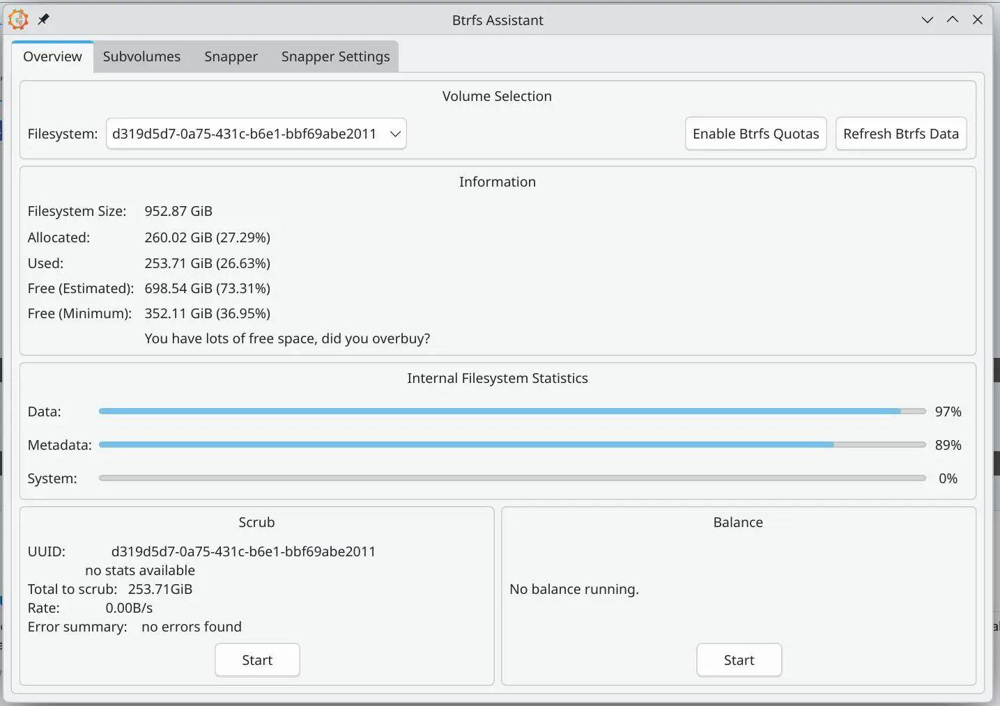
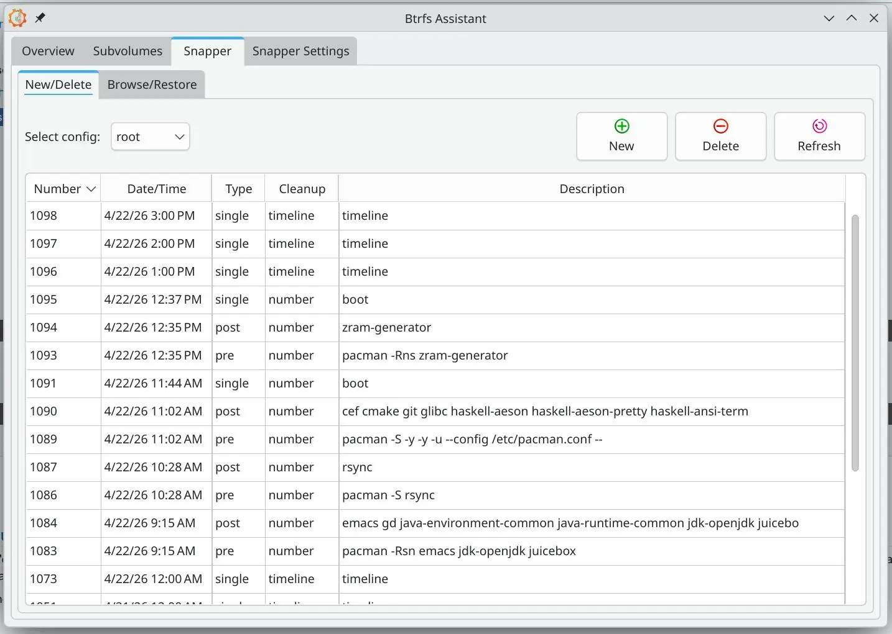

作为一个使用电脑频率极其高的人，我的电脑上保存了太多宝贵的数据和文件，但是再稳定的系统都会出现问题，所以系统数据备份是非常重要的。

## 系统级备份

我使用的文件系统是 Btrfs，支持快照，所以备份就很方便简单了，timeshift 默认也支持，此前我也使用 timeshift，但是后来换成了 btrfs-assistant，它本身不直接创建快照，而是调用 snapper 和 btrfsmaintenance 来完成任务。timeshift 主要是定时对系统创建快照然后保存，如果想要在 pacman -Syu 的时候创建快照，就需要使用一个 aur 包 [timeshift-autosnap](https://aur.archlinux.org/packages/timeshift-autosnap)。而 btrfs-assistant 本身就原生支持定时备份和事件驱动，并且记录更加详细，只需要点一下设置一下即可。除了快照管理，还能提供文件系统概览、挂载/卸载子卷、执行数据清理（Scrub）和均衡（Balance）等维护操作。





## 数据备份

我除了系统盘之外，多加了一块移动硬盘，我挂载为了`/data`，为了防止 Btrfs 炸掉，还特意设置为 ext4 格式，确保数据存放更安全稳定。

```bash
NAME        FSTYPE FSVER LABEL     UUID                                 FSAVAIL FSUSE% MOUNTPOINTS
nvme0n1
├─nvme0n1p1 vfat   FAT32           1439-CDE2                             913.5M    11% /boot
└─nvme0n1p2 btrfs        archlinux d319d5d7-0a75-431c-b6e1-bbf69abe2011  698.3G    27% /var/log
                                                                                       /var/cache/pacman/pkg
                                                                                       /home
                                                                                       /
nvme1n1
└─nvme1n1p1 ext4   1.0   data      6076a825-05b0-46ef-89f6-baac02379c1c  776.4G    12% /data
```

对于常用的数据，我会通过下面的脚本使用 rsync 和 systemd 配置去定时备份：

```bash
jiaoyuan:~ > cat /usr/local/bin/backup.sh
#!/bin/bash

BACKUP_DIR="/data/data_backup"
ROOT_DEST="$BACKUP_DIR/archlinux"
USER="jiaoyuan"

mkdir -p "$ROOT_DEST"

pacman -Qqen > "$BACKUP_DIR/pkglist_repo.txt"
pacman -Qqem > "$BACKUP_DIR/pkglist_aur.txt"

RSYNC_CMD="rsync -aR --ignore-missing-args -q"

$RSYNC_CMD --exclude '.*' --exclude 'downloads' --exclude 'qq' "/home/$USER" "$ROOT_DEST/"

$RSYNC_CMD --delete "/home/$USER/.ssh" "$ROOT_DEST/"
# $RSYNC_CMD "/home/$USER/.condarc" "$ROOT_DEST/"
$RSYNC_CMD "/home/$USER/.gitconfig" "$ROOT_DEST/"
$RSYNC_CMD "/home/$USER/.bashrc" "$ROOT_DEST/"
$RSYNC_CMD "/home/$USER/.bash_functions" "$ROOT_DEST/"
$RSYNC_CMD "/home/$USER/.Rprofile" "$ROOT_DEST/"

$RSYNC_CMD "/home/$USER/.config/rclone/rclone.conf" "$ROOT_DEST/"
$RSYNC_CMD "/home/$USER/.config/qq-bwrap-flags.conf" "$ROOT_DEST/"
$RSYNC_CMD "/home/$USER/.config/user-dirs.dirs" "$ROOT_DEST/"
$RSYNC_CMD --delete "/home/$USER/.config/gtk-3.0" "$ROOT_DEST/"
$RSYNC_CMD --delete "/home/$USER/.config/gtk-4.0" "$ROOT_DEST/"
$RSYNC_CMD "/home/$USER/.config/gtkrc" "$ROOT_DEST/"
$RSYNC_CMD "/home/$USER/.config/gtkrc-2.0" "$ROOT_DEST/"

$RSYNC_CMD "/home/$USER/.local/share/fcitx5/rime/default.custom.yaml" "$ROOT_DEST/"

$RSYNC_CMD /usr/local/bin/backup.sh "$ROOT_DEST/"
$RSYNC_CMD /etc/systemd/system/backup.timer "$ROOT_DEST/"
$RSYNC_CMD /etc/systemd/system/backup.service "$ROOT_DEST/"

chown -R $USER:$USER $BACKUP_DIR

echo "Backup completed successfully at $(date '+%Y-%m-%d %H:%M:%S')"
```

- `-a` 保留数据的权限结构
- `-R` 保留原本的文件结构
- `-q` 减少日志输出，防止干扰 journalctl 查看日志

这里也没必要全部备份，只需要保留个人数据和部分比较重要的配置文件即可，rsync 是增量备份，所以还可以当作一份保障，用来恢复误删的数据。使用的 systemd 配置如下：

```bash
jiaoyuan:~ > cat /etc/systemd/system/backup.timer
[Unit]
Description=Run backup weekly

[Timer]
OnCalendar=weekly
Persistent=true

[Install]
WantedBy=timers.target
jiaoyuan:~ > cat /etc/systemd/system/backup.service
[Unit]
Description=Backup Data and Config for Arch Linux

[Service]
Type=oneshot
ExecStart=/usr/local/bin/backup.sh
```

此外，手机相册和通讯录我也会定时进行备份，使用 adb pull 从手机上拷贝数据，比直接复制快很多，我这里设置了两个 bash 的别名：

```bash
pull() {
    case "$1" in
        dcim)
            mkdir -p ~/android && adb pull -a /sdcard/DCIM/ ~/android/ "${@:2}" && echo "DCIM pulled to ~/android"
            ;;
        contacts)
            mkdir -p ~/android/contacts
            adb shell "content query --uri content://com.android.contacts/data --projection display_name:data1 --where 'mimetype=\"vnd.android.cursor.item/phone_v2\"'" | sed $'s/Row: [0-9]* //g; s/display_name=//g; s/, data1=/\t/g' > ~/android/contacts/contacts_$(date +%F).txt && echo "Done: Contacts pulled to ~/android/contacts"
            ;;
    esac
}
complete -W "dcim contacts" pull
```

`pull dcim`拉取 DCIM 目录，`pull contacts`拉取手机通讯录，全部放在`~/android`目录，systemd 任务备份的时候还可以顺便再备份搭配`/data`。

但是只有本地存储似乎也不是很安全，后面打算使用 rclone 将数据备份到对象存储，这样也可以方便外出获取文件。

## zswap

此前我使用的是 zram，二者对比如下：

| 维度 | zram | zswap |
|------|------|-------|
| 架构 | 压缩块设备，独立 swap 分区 | 内存管理集成层，位于磁盘 swap 之前 |
| 容量行为 | 硬上限，填满即拒收 | 动态池 + 自动驱逐冷页到磁盘 |
| LRU 感知 | 无，块设备不感知冷热 | 有，内核知道哪些页是热的 |
| 与磁盘 swap 共存 | 高优先级先填满冷页，导致 LRU 反转（热页去磁盘） | 自动分层：热页留压缩 RAM，冷页降级到磁盘 |
| 写回/驱逐 | 需手动配置专用设备 + cron 脚本，基于时间阈值 | 自动、基于实时内存压力和 swap-in 率 |
| 不可压缩数据 | 全存（浪费 RAM/CPU） | 检测后拒绝，直接写磁盘 |
| OOM 行为 | 可能长时间假死（should_reclaim_retry 误判），OOM 难触发 | 渐进降级，压力大时部分页直写磁盘 |
| cgroup 隔离 | 内存不计入 cgroup，破坏隔离 | 支持 per-cgroup 写回控制 |
| SSD 磨损 | 无磁盘 swap 时反而增加 page cache 颠簸，可能增加 I/O | 有磁盘 swap 时减少 25% 写（如 Instagram 数据） |
| 适用场景 | 无磁盘嵌入式设备、Android（+ lmkd）、Fedora 桌面（+ systemd-oomd，无磁盘 swap） | 绝大多数通用场景（服务器、桌面、笔记本，有 SSD/HDD） |
| 维护趋势 | 上游逐步减少支持，计划用 zswap 替代 | 正扩展“无磁盘模式”，将覆盖 zram 用例 |

参考：[Debunking zswap and zram myths](https://chrisdown.name/2026/03/24/zswap-vs-zram-when-to-use-what.html)

并不建议 zswap 和 zram 同时开启，所以我要使用 zswap 的话就要先关掉 zram ：

```bash
sudo pacman -Rns zram-generator
sudo rm /etc/systemd/zram-generator.conf
```

然后先创建交换文件，Btrfs 文件系统上的交换文件有特殊要求，必须禁用写时复制：

```bash
# 创建一个空文件
sudo truncate -s 0 /swapfile
# 设置无写时复制属性
sudo chattr +C /swapfile
# 用 fallocate 填充它的大小
sudo fallocate -l 16G /swapfile
# 设置正确权限
sudo chmod 600 /swapfile
# 格式化为 swap
sudo mkswap /swapfile
```

启用交换文件：

```bash
sudo swapon /swapfile
swapon --show
```

写入 fstab：

```bash
echo '/swapfile       none    swap    defaults        0       0' | sudo tee -a /etc/fstab
```

到这里物理交换空间就创建完毕了，需要添加内核启动参数。我使用了 systemd-boot 并且开了 UKI，所以配置内核参数需要编辑内核命令行文件`/etc/kernel/cmdline`，这个文件里的内容会被 mkinitcpio 读取，并打包进 UKI ：

```bash
sudo nano /etc/kernel/cmdline
```

在末尾追加 zswap 的参数：

```bash
root=PARTUUID=xxxxxxxx-xxxx-xxxx-xxxx-xxxxxxxxxxxx rw loglevel=3 zswap.enabled=1 zswap.compressor=zstd zswap.max_pool_percent=25
```

最后把 `/etc/kernel/cmdline` 里的新参数打包进内核：

```bash
sudo mkinitcpio -P
```

随后重启即可。验证是否开启：

```bash
jiaoyuan:~ > cat /sys/module/zswap/parameters/enabled
Y
jiaoyuan:~ > free -h
               total        used        free      shared  buff/cache   available
Mem:            30Gi       8.0Gi        17Gi       2.1Gi       7.8Gi        22Gi
Swap:           15Gi          0B        15Gi
```
