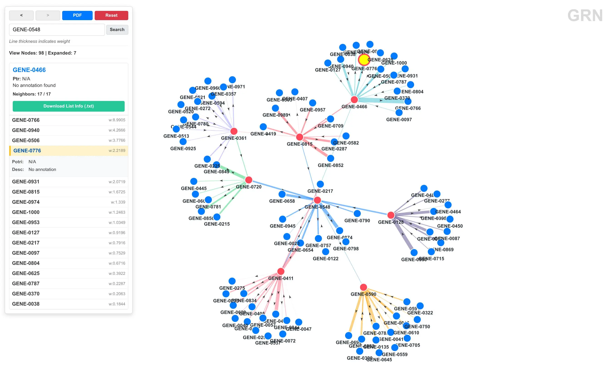
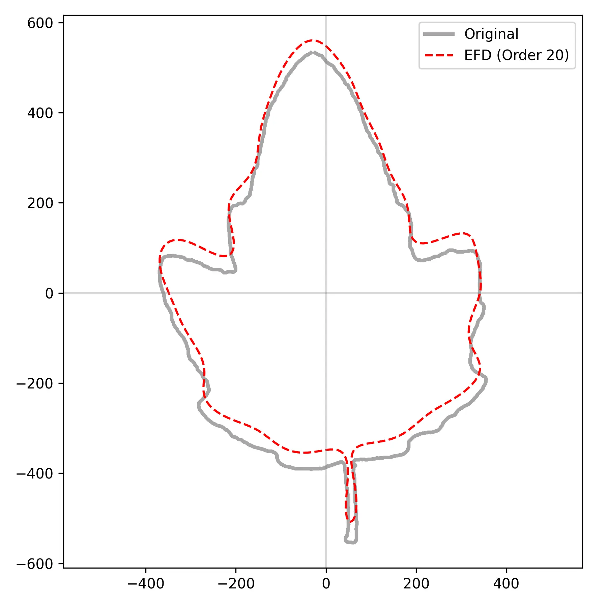

这个包整合了我之前写过的一些用作分析和画图的脚本，做成 pip 包用起来会更方便，不需要输入路径去调用了，并且也可以作为基础来扩展更多的功能，现在有 agent 加持，写这种包还是很简单的。这里的脚本主要都是用于生信分析和可视化的，我起名字叫`jsrc`，用我的名字首字母开头，`src`就是源代码的意思了，`jsrc` 按功能分成模块，各模块之间没有依赖关系，想用哪个用哪个。

项目地址：https://github.com/imjiaoyuan/jsrc

使用 pip 安装：

```bash
pip install jsrc
```

不过现在可能 uv 才是版本答案，可以自动解决依赖问题：

```bash
uv venv
uv run jsrc -h
```

核心依赖只有 biopython 和 numpy，其他的按需安装：

```bash
pip install "jsrc[plot]"    # 可视化（matplotlib + plotly）
pip install "jsrc[gs]"      # 基因组选择（pandas + scikit-learn）
pip install "jsrc[vision]"  # 图像分析（opencv-python）
pip install "jsrc[all]"     # 全部都装
```

CLI 入口是 `jsrc`，后面跟模块名和子命令。模块都使用懒加载，用到哪个才 import 哪个，启动速度不受模块数量影响。如果不想加载某些模块，可以通过环境变量控制：

```bash
export JSRC_DISABLE_MODULES=gs,vision   # 禁用不用的模块
export JSRC_MODULES=seq,plot,analyze     # 或者只启用某几个
```

目前有 7 个模块，包括序列处理、可视化、基因组选择、基因调控网络展示、图像分析和后台任务管理：

```
seq      序列提取、翻译、QC、k-mer、滑窗分析
plot     基因/外显子/染色体/结构域/点图/环形图可视化
analyze  系统发育、motif、一致序列、SNP/INDEL、QC
gs       基因组选择数据集构建、划分、模型训练
grn      基因调控网络格式转换、中心性、交互式网络 viewer
vision   图像轮廓提取、椭圆傅里叶描述子、形态指标
job      后台任务提交、监控、日志、清理
```

## 序列操作

这是最简单常用的模块，生信分析中反复出现的场景就是从基因组里提取特定区域啥的，seq 模块把这些操作统一成了几个子命令。

手里有基因组 FASTA、GFF 注释文件、以及一个基因 ID 列表，可以使用`extra`提取这些基因的指定类型序列，比如 CDS 序列：

```bash
jsrc seq extract -fa genome.fa -gff genes.gff -ids ids.txt -o cds.fa -feature CDS -match Parent
```

这里 `-feature` 指定提取 CDS，也可以改成 gene、exon、mRNA 等，要看注释文件中对应的是什么。`-match` 是 GFF 属性里用来匹配 ID 列表的字段，也是要从注释文件中查看的。`-match Parent` 代表 ID 列表里的是基因名，而 GFF 的 CDS 行用 `Parent` 属性指向对应的基因。这个命令不是简单地找相同 ID 就提取，它会把同一个基因的多个 CDS 片段按照染色体坐标排序，合并重叠区域，再连成一条完整序列。遇到负链基因会自动取反向互补。输出是一个 FASTA，每个基因一条记录。

提取 CDS 后可以翻译成氨基酸序列：

```bash
jsrc seq translate -fa genome.fa -gff genes.gff -id ID -o proteins.fa
```

它会解析 GFF 里的 CDS 特征，按基因分组、排序坐标、从基因组取序列，遇到负链自动反向互补，最后用 Biopython 翻译。碰到有移码的序列会跳过并给出警告。

不同来源的序列 ID 格式各不相同，命名方式五花八门，rename 可以把它们统一成自己想要的格式，支持 CSV 映射和 GFF 关联两种模式：

```bash
jsrc seq rename -fa in.fa -mode csv -map mapping.csv -o out.fa

jsrc seq rename -fa in.fa -mode gff -gff genes.gff -parent Parent -o out.fa
```

CSV 就是一个两列的映射表，第一列是原名，第二列是新的名称。GFF 模式则更适合从基因组注释做重命名，比如拿 mRNA 的 ID 去匹配它在 GFF 中的父基因名。

做顺式元件分析经常需要批量截取启动子。promoter 按基因列表一把全提出来，可以对每个基因指定上游和下游的长度：

```bash
jsrc seq promoter -fa genome.fa -gff genes.gff -ids genes.txt -o promoters.fa -up 2000 -down 0
```

正链基因取起始密码子上游 N bp，负链基因取终止密码子下游 N bp（也就是上游）并反向互补。坐标超出染色体边界也会自动 clamp。

这是最轻量的 QC 工具，适合在进入复杂分析前快速看一眼序列的基本状况：

```bash
jsrc seq qc -fa assembly.fa
```

```
QC: 2 sequences, 268 bp total, GC 56.7%, N50 160.
```

支持 FASTA（组装统计）和 FASTQ（测序统计），可以同时给：

```bash
jsrc seq qc -fa assembly.fa -fq r1.fq.gz r2.fq.gz -gs 520000000 --json
```

如果给了 FASTQ 和基因组大小，还能估算测序深度。`--json` 可以输出结构化数据用于后续处理。FASTQ.GZ 也直接支持，不需要先解压。

从 CDS 序列计算密码子使用频率和 RSCU 值。RSCU > 1 表示该密码子使用偏多，< 1 表示偏少：

```bash
jsrc seq codon -fa cds.fa --top 20 --json
```

它会按阅读框解析 CDS，跳过终止密码子和非 ACGT 字符，然后对每个氨基酸分别计算 RSCU。单条 CDS 或多条合并都可以。

k-mer 算是序列的"成分指纹"，这个命令既可以对单条序列做高频 k-mer 统计，也可以在多个样本间算余弦距离：

```bash
# 单样本，看高频 k-mer
jsrc seq kmer -fa a.fa -k 7 --top 30

# 多样本，算两两余弦距离
jsrc seq kmer -fa a.fa b.fa c.fa -k 5
```

多文件时输出的是一个距离矩阵，值在 0 到 1 之间，越接近 0 表示序列组成越相似。可以用来快速判断样本间是否大体一致。

GC 含量沿染色体的分布不是均匀的，滑窗分析能揭示局部变化。window 会在指定序列上做滑窗统计，输出每个窗口的 GC%、AT skew 和 GC skew：

```bash
jsrc seq window -fa genome.fa -id chr1 -w 1000 -s 200 --head 20
```

GC skew 的正负可以指示复制起点和终止点的位置（前导链倾向于 G 多于 C），这在原核基因组分析中比较有用。

## 一些简单的分析操作

序列比对做完之后，常见操作就是建树、找 motif、看保守性、找差异。analyze 把这些串了起来，但是本着使用尽量少的依赖的原则（极简主义者癖好），所以目前实现的分析其实比较有限。

对一组比对好的或未比对的序列，用邻接法或 UPGMA 建一棵树，输出 Newick 格式。底层用 Biopython 的距离计算和建树模块：

```bash
# 邻接法（默认）
jsrc analyze phylo -fa aligned.fa -o tree.nwk

# UPGMA
jsrc analyze phylo -fa aligned.fa -a upgma -o tree.nwk
```

输入序列未比对的话会自动做等长填充（短的补 `-`）。输出的 Newick 可以用任意树可视化软件查看。

phylo 的进阶版——bootstrap 重复采样给分支打上置信度。重复次数和随机种子都可以设置，保证结果可重复：

```bash
jsrc analyze bootstrap_phylo -fa seqs.fa -n 200 -seed 42 -o boot.nwk
```

内部实现是先构建基准树，然后对多序列比对的列做有放回重采样，每次重采样重新建树，统计每个分支出现的频率作为 bootstrap 值。需要至少 3 条序列。

最直接的 motif 寻找方式——从序列中枚举所有 k-mer，按出现频率排序。虽然不如 MEME 这类专业工具精细，但胜在速度快、结果直观，适合先粗筛再决定要不要上更重的工具：

```bash
jsrc analyze motif -fa promoters.fa -o motif_out -nmotifs 5 -minw 6 -maxw 12
```

从多序列比对中计算一致序列和每个位点的保守性分数。保守性 = 该位点出现频率最高的碱基的比例，数值越高表示该位点越保守：

```bash
jsrc analyze msa_consensus -fa aligned.fa --json
```

可以用来快速判断比对质量：整体保守性高说明序列之间相似性好，适合做进化分析；如果整体保守性偏低，可能需要换个比对策略。

只比对两条序列，给出 SNP 和 INDEL 的详细统计。用 Biopython 的 `PairwiseAligner` 做全局比对：

```bash
jsrc analyze snpindel -fa pair.fa --json
```

输出比对得分、对齐长度、匹配碱基数、SNP 数、INDEL 事件数和涉及的碱基数。非常适合做同一基因在不同样本间的快速比较。

这个命令可以同时接收 FASTA（组装统计）、SAM（比对统计）、VCF（变异统计）、FASTQ（测序统计），一次性给出多角度的质量概览：

```bash
jsrc analyze qc -fa assembly.fa -sam aln.sam -vcf variants.vcf.gz -fq r1.fq.gz r2.fq.gz -gs 520000000
```

比 `seq qc` 多了解析 SAM 比对 CIGAR 计算深度和 VCF 区分 SNP/INDEL 的功能。适合在做完整套分析后做一次统一的质控汇总。

## 简单的可视化

做生信分析少不了要画图，不管是汇报还是文章。plot 模块把几种最常见的生物学图形封装成了命令行，输入 GFF 或 TSV 就可以出图，省去写 matplotlib 代码的时间。

所有图都输出 PNG，内核统一用 matplotlib Agg 后端，不需要显示器环境。

GFF + ID 列表画基因结构示意图。每个基因用一条水平线表示全长，蓝色方块表示 CDS 区域：

```bash
jsrc plot gene -gff genes.gff -ids ids.txt -o gene.png -dpi 300
```

基因会按自然序（chr9 排在 chr10 前面，而不是字典序）纵向排列，适合展示多个基因的结构差异。

和 gene 类似，但突出外显子区域，用绿色区分：

```bash
jsrc plot exon -gff genes.gff -ids ids.txt -o exon.png -dpi 300
```

如果你更关注外显子的数量和分布差异而不是整个 CDS，用 exon。

把基因在染色体上的位置可视化出来。读取 GFF 里的 `##sequence-region` 元数据作为染色体长度，然后在对应位置画红色标记：

```bash
jsrc plot chromosome -gff genes.gff -ids ids.txt -o chr.png
```

不加 `-ids` 时把所有基因都画上，加了就只标出目标基因。适合看基因在染色体上的聚集情况。

TSV 格式输入，每行是一个结构域，包含蛋白名、结构域名、起始和终止位置：

```bash
jsrc plot domain -tsv domains.tsv -o domain.png
```

每个蛋白一条水平线，结构域用橙色方块标出并标注名称。适合快速查看结构域顺序和相对位置。

BED 格式输入，在染色体上标出顺式元件的分布：

```bash
jsrc plot cis -bed motifs.bed -o cis.png
```

每条染色体画一条水平线，元件用蓝色竖线标出，并带名称标签。

用精确 k-mer 匹配画两条序列的点图。对角线上的点表示两序列的共线性区域，散落在外的点可能代表重复序列或重排：

```bash
jsrc plot dotplot -fa1 genome1.fa -fa2 genome2.fa -k 10 -o dotplot.png
```

`-k` 控制 k-mer 大小：k 越小点越密但假阳性越多，k 越大特异性越高。不指定 `-o` 的话会弹出交互式窗口。

一个轻量级的 Circos 替代方案——输入 FASTA，画出环形染色体分布图，内圈显示 GC 含量滑窗统计：

```bash
jsrc plot circoslite -fa genome.fa -w 100000 -o circos.png
```

`-w` 控制滑窗大小，默认 100 kb。外圈灰色环是染色体骨架，内圈蓝色柱子表示该窗口的 GC 比例。

还有两个是当作小彩蛋加的。heart 画一个动态心形曲线（matplotlib 动画），rose 画一个 3D 玫瑰曲面（Plotly 交互）：

```bash
jsrc plot heart
jsrc plot rose
```

没什么实用价值，纯属写着玩的。

## 基因组选择

基因组选择的分析流程相对固定：数据准备、划分交叉验证、模型训练和评估。gs 模块把这三个步骤做成了三个子命令，串成一条流水线。

输入 PLINK 二进制文件和表型文件，构建带模拟样本的数据集：

```bash
jsrc gs build -pheno phenotype.txt -plink /path/to/hap1 -o data/hap1 --n-sim 500 --top-k 2000 --h2 0.5 --seed 42
```

内部流程是这样的：

- 先用 PLINK 做 LD pruning（`--indep-pairwise 50 5 0.2`），得到近似独立的 SNP 集合
- 用 `pandas-plink` 读取修剪后的基因型数据
- 对真实数据做 ANOVA F 检验筛选 top K 标记作为候选因果位点。
- 从真实样本中随机抽取两条作为"亲本"，对每个标记随机选择来自亲本 1 或亲本 2，模拟子代基因型
- 用因果位点的线性组合计算育种值，添加高斯噪声控制遗传力（`--h2`）。
- 输出 `X.npy`（基因型矩阵）、`y.npy`（表型）、`sample_ids.txt` 和 `snp_ids.txt`

模拟样本的遗传力参数很重要，h2=0.5 表示表型变异中一半由遗传因素解释，这在模拟中可以灵活调整来评估不同遗传力下的预测准确性。

把真实样本随机分成 K 折，模拟样本全部加入训练集：

```bash
jsrc gs split -i data/hap1 --folds 5 --seed 2024
```

输出 cv_indices 目录，每折包含 `fold_{i}_train.txt` 和 `fold_{i}_test.txt`，分别记录行号。

在交叉验证上运行多个模型并比较结果：

```bash
jsrc gs train -i data/hap1 -o data/hap1/results --folds 5 --select-k 1000 --models gbdt,rf,et,lr,svm,nb
```

支持 6 种 Python 模型：

| 代码 | 模型 | 主要参数 |
|------|------|----------|
| gbdt | Gradient Boosting | 200 棵树，lr=0.05, max_depth=4 |
| rf | Random Forest | 300 棵树，class_weight=balanced |
| et | Extra Trees | 300 棵树，class_weight=balanced |
| lr | Logistic Regression | LBFGS, max_iter=2000 |
| svm | SVC | RBF 核，probability=True |
| nb | Gaussian Naive Bayes | — |

每个模型在每折上记录 accuracy、F1、MSE、AUC。最终输出 `results.csv`（逐折逐模型）和 `summary.csv`（各模型的均值和标准差），可以直接看哪个模型在这个数据集上表现最好。

## 基因调控网络可视化

这个是我自认为做的很好看的一个 grn 网络可视化。基因调控网络分析通常包含几个步骤，数据格式转换、计算网络统计量、可视化。grn 模块覆盖了这些环节，而且自带了完整的交互式网络浏览器。

GRN 的数据通常有散列：source、target、weight。`net2json` 把它们转成 JSON，启动 http 服务器以后可以动态加载，并且可以打包成独立的 ZIP 文件：

```bash
jsrc grn net2json -i network.tsv -o json/grn.json -n annotation.tsv -z viewer.zip -s
```

展示模式有两种：

- `-a`（all 模式）：当网络中的基因数量小于等于阈值时，自动全量展示整张网络。适合几百个基因的小网络。
- `-s`（some 模式）：初始只显示一个空画布，通过搜索基因名来展开其邻居。适合几千个基因的大网络，不会把浏览器卡死。

可选的 `-n` 参数接受一个注释 TSV，包含基因 ID、Potri ID 和功能描述，这些信息会在 viewer 里显示在节点的详情面板中（最开始给杨树做的所以有 Potri ID，后续会完善）。

想知道哪些基因在调控网络中处于核心位置，最直接的方式就是算度（degree）。这个命令统计每个节点的入度、出度和总度，按总度排序输出：

```bash
jsrc grn centrality -i network.tsv --top 30
```

输出：

```
rank    node        in_degree   out_degree  total_degree
1       GENE_0504   24.14       34.97       59.12
2       GENE_0785   26.37       29.51       55.88
...
```

入度高说明该基因被很多其他基因调控（"听命令的"），出度高说明该基因调控很多其他基因（"发号施令的"）。总度排名靠前的往往是转录因子或信号通路的关键节点。

网络数据准备好之后，直接在本地起一个 HTTP 服务查看：

```bash
jsrc grn serve -d viewer -g json/grn.json -n json/annotation.json -p 8000 -s
```



这个 viewer 是基于 D3.js 的 Force Graph 实现的交互式页面，功能包括：

- 力导向布局，节点自动排斥、边自动吸引
- 点击节点展开其 top 100 邻居（有边权排序）
- 搜索框可以快速定位到指定基因
- 信息面板显示基因的 Potri ID 和功能描述
- 邻居列表按边权降序排列，支持下载为 TXT
- PDF 导出（通过 html2canvas + jsPDF）
- 前进/后退导航历史

如果你只需要把注释 TSV 转成 JSON，不涉及网络转换，可以直接用这个：

```bash
jsrc grn anno2json -i annotation.tsv -o json/annotation.json
```

## 图像分割与数值化

vision 模块主要面向植物叶片之类复杂图像的轮廓提取和形状分析，用 OpenCV 做底层的图像处理。

这是图像分析的第一步——从原始照片中提取出目标物体的轮廓。输入一张照片，输出每个物体的轮廓点集和边缘图：

```bash
jsrc vision extract -i leaf.jpg -o extracted/ --channel a --invert --save-mask
```

处理流程：

- 高斯模糊降噪（`--blur` 控制核大小）
- 提取指定通道（灰度、LAB a/b 通道、HSV s/v）
- Otsu 自动阈值二值化
- 形态学开运算去噪点 → 闭运算填孔洞
- 找外轮廓
- 按面积和长宽比筛选（排除太小的噪点和太大的背景）
- 按 x 或 y 坐标排序输出

通道选择对结果影响很大。绿色叶片在 LAB 色彩空间的 a 通道（绿-红轴）上对比度最好，比直接用灰度图鲁棒得多。输出两个文件：`{name}_{i}_edge.png`（轮廓）和 `{name}_{i}.npy`（轮廓点坐标数组）。

提取出轮廓之后，使用傅里叶级数逼近闭合轮廓，级数的系数可以作为形状的定量特征：

```bash
jsrc vision efd -i extracted/ -o descriptors/ --harmonics 20 --points 300
```

EFD 的数学想法很简单：把轮廓的 x 坐标和 y 坐标分别看作弧长的周期函数，对它们做傅里叶展开。前几个谐波描述粗略形状，后面的谐波增加细节。通常 10-20 个谐波就能很好地重建大部分生物形状。

这个命令的输出是 `{name}_efd.csv`，包含 an、bn、cn、dn 四个系数的列。系数的数量 = 谐波数 × 4（比如 20 个谐波就有 80 个系数）。默认会生成一个对比图，把原始轮廓（黑色）和 EFD 重建轮廓（红色虚线）叠在一起展示。

<div style="display: flex; gap: 8px;">
  
  
</div>

系数做了归一化处理：旋转不变性（把第一谐波椭圆的长轴对齐到 0°）、缩放不变性、起始点归一化。这样即使照片里叶片的摆放角度、大小不同，同一种叶形的系数也是相近的。

做图像测量时经常需要计算面积、周长、圆度等指标。traits 命令从图像中提取最大物体的形态参数：

```bash
jsrc vision traits -i leaf.jpg --channel a --invert
```

```
area            461833.5
perimeter       3479.84
aspect_ratio    0.671
circularity     0.479
extent          0.535
solidity        0.837
```

各指标的含义：

| 指标 | 含义 | 用途 |
|------|------|------|
| area | 像素面积 | 绝对大小 |
| perimeter | 轮廓周长 | 边界复杂度 |
| aspect_ratio | 宽高比 = 宽/高 | 细长程度 |
| circularity | 圆度 = 4π·area/perim² | 接近圆形的程度，1=正圆 |
| extent | 填充度 = area/外接矩形面积 | 形状的紧凑性 |
| solidity | 实心度 = area/凸包面积 | 边缘的锯齿/裂片程度 |

## 后台任务管理

经常跑任务的会遇到一个问题，如果用集群的 slurm 作业系统还好，但是小服务器上面使用 nohup 把任务挂后台的话，可能会分辨不出任务究竟是哪个、任务有没有正常完成、任务运行多长时间之类的问题，所以我做了这个`job`模块，做的事情就是把"nohup + 记录 PID + 定时查日志 + 收尾清理"这个流程标准化。

```bash
jsrc job submit "Rscript 02.harmony2.R" -N harmony -C /data/proj -S bash
```

它会用 nohup 启动命令，同时记录 PID、启动时间、工作目录。每条记录自动分配一个 job_id。如果没指定日志路径，会自动在 `~/.local/share/jsrc/job-logs/{id}.log` 创建一个。

这里在后台包装了一层——命令外面包了一个 `echo $? > state_file` 的尾随命令，用来捕获退出码。这样即使命令跑完了，也能区分正常退出（exit code 0）、失败（非 0）还是被杀死。

```bash
jsrc job ls -w -s rss_mb -r -l 20

# 只看特定任务
jsrc job ls -q harmony
```

`-w` 模式会每 2 秒刷新一次，持续监控运行状态。列可以自定义选择，排序字段也很多——运行时长、RSS 内存（当前/平均/峰值）都可以当排序依据。

RSS 内存是从 `/proc/{pid}/status` 读的（Linux），对于追踪内存泄漏或确认任务是否正常运行很有用。`ls` 会记录每个任务的 RSS 最小值、峰值和平均值，而不是只存当前快照。

```bash
jsrc job show 12 -f json
```

比 ls 更详细地展示单条记录的全部字段，适合精确定位问题。

```bash
# 看最后 200 行
jsrc job logs 1 -n 200

# 实时跟随输出
jsrc job logs 1 -F
```

支持 follow 模式，类似 `tail -f`。方便在跑长任务时实时看输出。

```bash
# 温柔终止
jsrc job kill 12 -s TERM

# 暴力终止，连子进程一起杀
jsrc job kill 12 -s KILL -g
```

`-g` 会把整个进程组杀掉，避免僵尸子进程残留。

```bash
jsrc job history -l 100 -f tsv
```

默认保留最近 50 条，可以用 `-l` 扩展。除了不占用终端历史，好处是即使跨了终端会话、甚至机器重启了，记录还在。

时间久了积累的记录和状态文件越来越多，做一次清理：

```bash
jsrc job gc -k 1000 --prune-missing-log --remove-dead-state
```

`-k` 是保留最近多少条历史，`--prune-missing-log` 标记日志文件已被删除的记录，`--remove-dead-state` 清理不在历史中的陈旧状态文件。

所有 job 数据存在 `~/.local/share/jsrc/jobs`（也可以设 `JSRC_JOBS_FILE` 环境变量改路径），是一个 TSV 文件。每条记录包含：job_id、名称、提交时间、开始结束时间、状态、PID、退出码、工作目录、日志路径、RSS 统计、运行时长、原始命令。

状态机：`running` → `exited`（码 0）/ `failed`（非 0）/ `killed`（信号）/ `lost`（失踪）。

## 不足

最大的问题就是测试不全面，很多问题没有暴露出来，所以希望有更多人来用，我们一起找问题解决问题，如果有朋友有好的建议也可以找我，尽量方便更多人使用。
