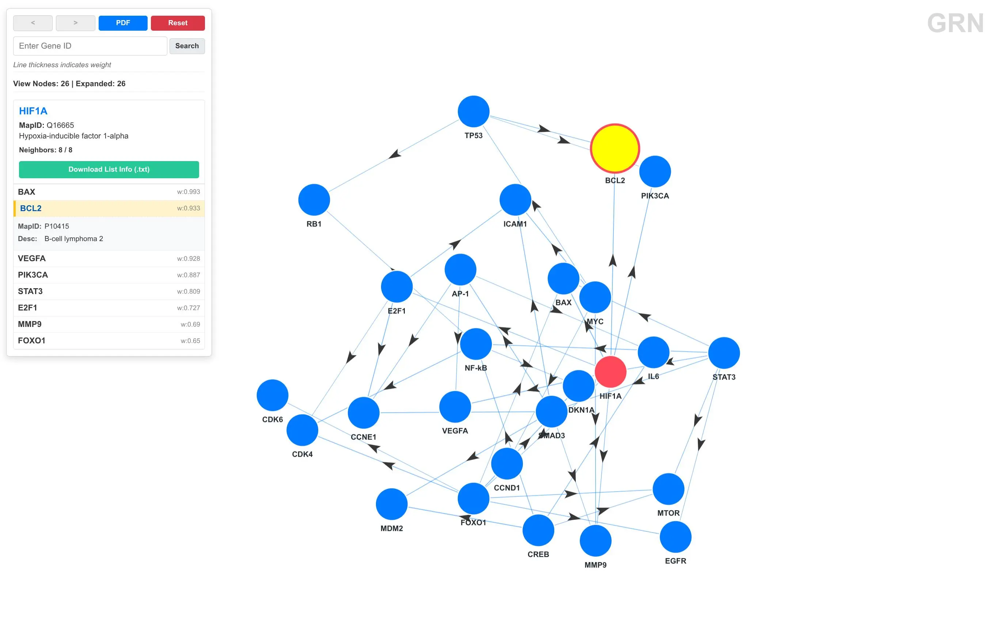

基因调控网络（Gene Regulatory Network, GRN）描述了转录因子如何调控靶基因的表达，是理解细胞功能和疾病机制的关键。jsrc 的 GRN 模块提供了从数据转换到交互式可视化的完整工具链，包含 5 个子命令：net2json、anno2json、centrality、build 和 serve。

推荐使用 uv 安装，方便全局调用，在 Linux 服务器上不用管理员权限也可以安装 uv 的：

```bash
curl -LsSf https://astral.sh/uv/install.sh | sh
uv tool install jsrc
```

如果需要安装所有模块则使用下列命令：

```bash
uv tool install jsrc[all]
```

## 数据准备

GRN 模块需要两个输入文件，都是 TSV 格式：

网络边表包含三列：调控基因、靶基因、调控强度（0-1）：

```tsv
MYC	CCND1	0.612
MYC	ICAM1	0.868
TP53	PIK3CA	0.515
STAT3	MTOR	0.710
NF-kB	CDKN1A	0.639
```

注释包含三列：基因 ID、功能描述、UniProt ID（第三列可选）：

```tsv
MYC	Myc proto-oncogene protein	P01106
TP53	Tumor protein p53	P04637
STAT3	Signal transducer and activator of transcription 3	P40763
CCND1	Cyclin D1	P24385
```

## net2json

首先需要将 TSV 格式的边表转换为 JSON 格式，用于 Web 可视化，方便浏览器动态读入：

```bash
jsrc grn net2json -i network.tsv -o grn.json
```

输出：

```
Network JSON written: grn.json
Genes: 26 | Edges: 44
```

生成的 JSON 格式：

```json
[
  {"source": "MYC", "target": "CCND1", "val": 0.612},
  {"source": "MYC", "target": "ICAM1", "val": 0.868},
  ...
]
```

## anno2json

同理，将注释表转换为 JSON 格式：

```bash
jsrc grn anno2json -i annotation.tsv -o annotation.json
```

生成的 JSON 格式：

```json
{
  "MYC": {"p": "P01106", "d": "Myc proto-oncogene protein"},
  "TP53": {"p": "P04637", "d": "Tumor protein p53"},
  ...
}
```

其中 `p` 是 UniProt ID，`d` 是功能描述。

## centrality

计算网络中每个节点的中心性指标，用于识别关键调控因子：

```bash
jsrc grn centrality -i network.tsv --top 10
```

输出：

```
nodes	26
edges	44
node	in_degree	out_degree	total_degree
HIF1A	0.8090	5.8080	6.6170
FOXO1	0.6500	4.6810	5.3310
SMAD3	0.7730	4.1270	4.9000
STAT3	0.0000	4.5170	4.5170
NF-kB	1.6900	2.1290	3.8190
CREB	0.0000	3.2810	3.2810
E2F1	0.7270	2.2740	3.0010
MYC	0.0000	2.9710	2.9710
AP-1	0.8610	1.9830	2.8440
CCNE1	2.5500	0.0000	2.5500
```

- in_degree：入度，表示该基因被多少个其他基因调控
- out_degree：出度，表示该基因调控多少个其他基因
- total_degree：总度数，反映该基因在网络中的重要性

从结果可以看出，HIF1A 和 FOXO1 是网络中最重要的调控因子，STAT3 和 CREB 主要作为调控者（出度高，入度为 0），CCNE1 主要作为靶基因（入度高，出度为 0）。

- `--sep`：列分隔符，默认自动识别空格或制表符
- `--top`：显示前 N 个节点，默认 20

## build

构建 Web 可视化应用，生成 HTML、CSS、JavaScript 和数据文件：

```bash
jsrc grn build -d viewer -g grn.json -n annotation.json
```

生成的目录结构：

```
├── css
│   └── style.css
├── index.html
├── js
│   └── script.js
└── json
    ├── annotation.json
    └── grn.json
```

打包为 ZIP 文件：

```bash
jsrc grn build -d viewer -g grn.json -n annotation.json -z grn_viewer.zip
```

参数说明：

- `-d, --dir`：输出目录，默认当前目录
- `-g, --grn-json`：网络数据 JSON 文件
- `-n, --annotation-json`：注释数据 JSON 文件（可选）
- `-z, --zip-output`：打包为 ZIP 文件
- `-a, --all`：全视图模式，节点数小于阈值时自动展开所有节点（默认）
- `-e, --expand`：点击展开模式，需要点击节点才展开邻居
- `-t, --threshold`：全视图阈值，默认 300
- `--max-nodes`：最大显示节点数，0 表示不限制

## serve

启动本地 HTTP 服务器，快速预览可视化效果：

```bash
jsrc grn serve -g grn.json -n annotation.json -p 8000
```

在浏览器中打开 `http://127.0.0.1:8000` 即可查看可视化界面，效果如下：



- 搜索框输入基因 ID，点击 Search 按钮查看调控关系
- 点击节点展开其邻居节点
- 使用 `<` 和 `>` 按钮前进/后退导航历史
- Reset 按钮重置视图
- PDF 按钮导出当前视图为 PDF 文件
- 节点颜色：红色表示当前选中的基因，蓝色表示邻居基因，灰色表示其他基因
- 边的粗细表示调控强度（weight 值）
- 右侧面板显示节点计数和邻居列表，点击邻居可以跳转查看

参数说明：

- `-g, --grn-json`：网络数据 JSON 文件（必需）
- `-n, --annotation-json`：注释数据 JSON 文件（可选）
- `-d, --dir`：服务目录，默认当前目录
- `-p, --port`：端口号，默认 8000
- `-a, --all`：全视图模式（默认）
- `-e, --expand`：点击展开模式
- `-t, --threshold`：全视图阈值，默认 300

## 性能优化

对于大规模网络（节点数 > 500），建议使用点击展开模式：

```bash
jsrc grn serve -g large_network.json -e
```

或者限制最大节点数：

```bash
jsrc grn build -g large_network.json --max-nodes 500
```

也可以先用 centrality 找出重要节点，然后筛选网络边表，只保留这些节点的调控关系。
