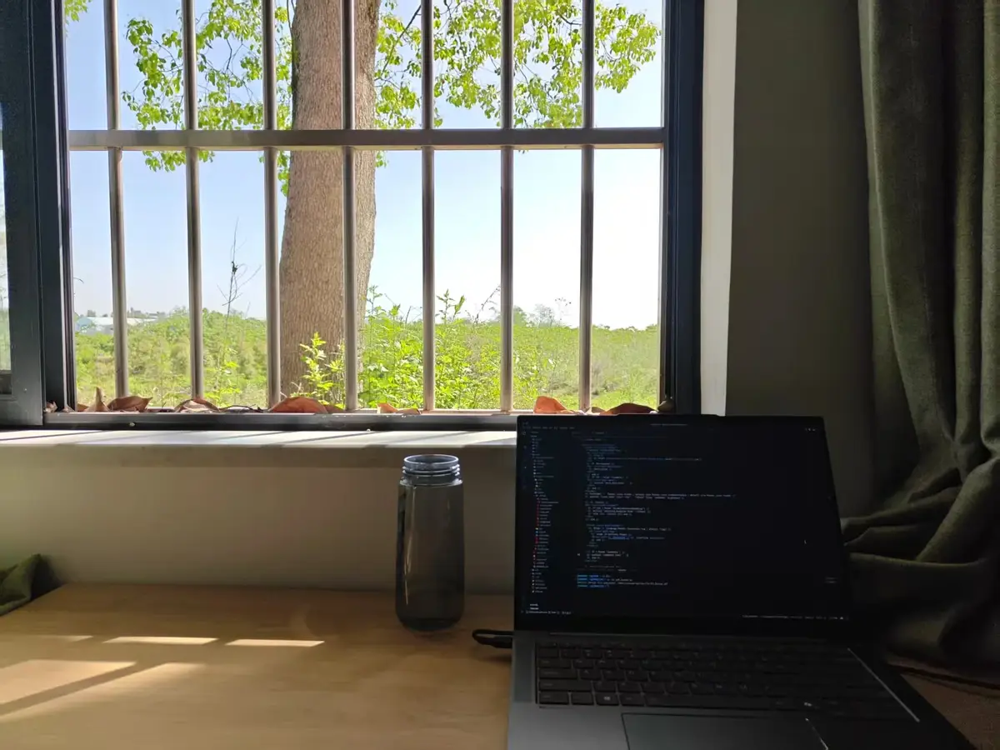
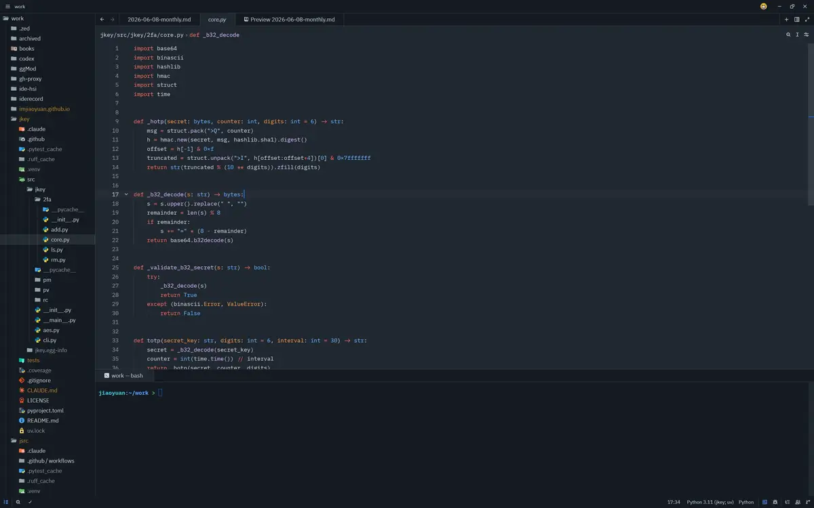
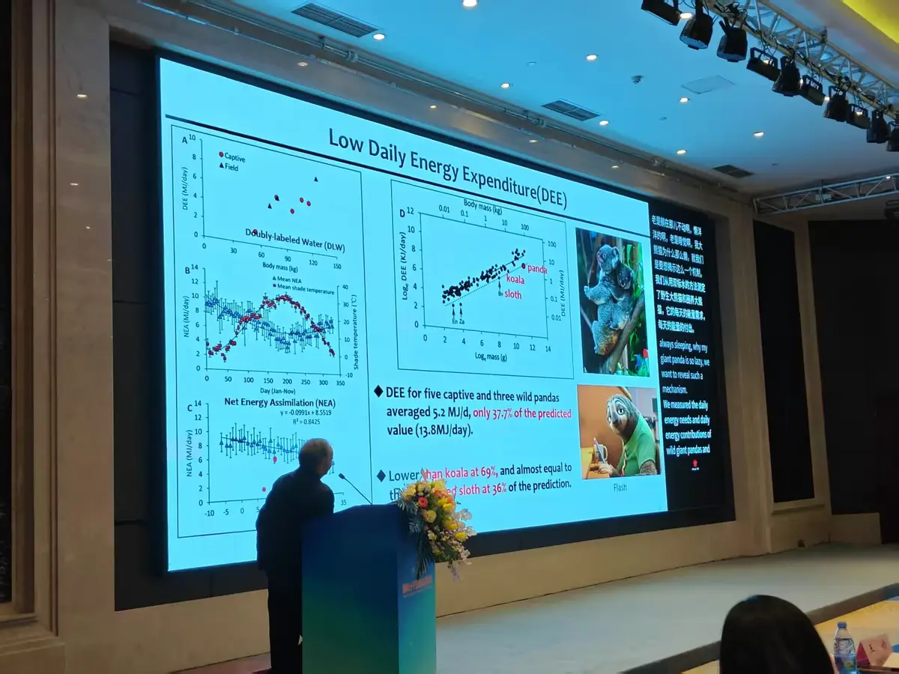

本篇是对 2026 年 5 月至 7 月的记录与思考。

*我爱上一个丁香般的姑娘，她的爱如丁香般细小，却积攒成花海；她的眼眸藏着暮色的紫，她的笑容像四月的风，轻轻吹开一树一树的芬芳。*

*她不说话，只是静静站着，整个成都便有了心事。我想为她解开丁香结，让丁香的美永远漾在时光里。*

*她的香气弥漫在时间里，让每一个平凡时刻都成了诗。*

*他们说，丁香是用来忧愁的，可我分明闻见了甜——那是一种让我忘却所有的甜。*

*五瓣的丁香是幸运，而你是比幸运更重的事。我想收集所有春天的香气，只为在时间中留下你。*

*开吧，开吧，开到青丝成了白发——我仍愿守在这一树丁香下，拾起你所有的花，让丁香填满往后的余生。*

---

丁香结了又开，这两个月，我像是在解一个又一个的结。

## Agent 时代

现在 AI agent 已经开始渗入越来越多人的生活之中了，很多和计算机相关的领域都开始使用 agent 了，生信也是如此，我所知道的越来越多的人都开始使用 agent 来编写代码。原因也很简单，我们并不需要写很复杂的东西，而 agent 能够在最快的时间内帮我写好代码，我可以将更多的时间集中在结果的分析和对科学问题的思考上了，在服务器上我也在使用 agent 了，用的是 Claude Code + DeepSeek API，还是在一定程度上提升了一些工作效率。

凭借 agent 我最近也做了很多事情：

- 优化了[RSS 页面](https://jiaoyuan.org/RSS)，改善了阅读界面和订阅的划分，并且手动写了一个路由去抓取少数派 matrix 的文章，少数派的部分文章还是不错的，但是大部分文章让人感觉很奇怪，消费主义的观念似乎才是这个网站的核心？后续也会去自制更多的路由来抓取一些更有价值的信息。没办法，国内网站太过于封闭，对 RSS 的支持太差，我不想被推荐算法困住，只能自己想办法造轮子了。其实微信公众号上有很多很有价值的文章，但是微信已经把别的路封死了 ...
- 改进了[gh-proxy](https://github.com/imjiaoyuan/gh-proxy)项目，原版是由别人开发的，部署在 Cloudflare Workers 的一个 GitHub 镜像，但是原版项目存在诸多问题，我做了一些改进和完善，部署在 github.jiaoyuan.org，主要用来帮助服务器和超算访问 GitHub 的内容。
- 开发了[jsrc](https://github.com/imjiaoyuan/jsrc)和[jkey](https://github.com/imjiaoyuan/jkey)，这两个 pip 包，之前说过了不再赘述，不过最近打包了 aur 包[python-jsrc](https://aur.archlinux.org/packages/python-jsrc)和[python-jkey](https://aur.archlinux.org/packages/python-jkey)，因为我习惯于使用统一的包管理器去管理软件包，使用 uv tool 感觉不爽，用 aur 安装可以方便在 ArchLinux 上的使用。
- 和别人合作开发生信的可视化与分析的软件包，目前还处于比较起步的阶段就不说了。

最近 Claude Code 识别中国用户的新闻让人心里很不舒服，所以最近我也在想该用什么去替代 Claude Code，A 社确实是一家很有实力的公司，他们的模型代表了这个世界上最先进的人工智能水平，但是他们的行径却配不上官博上那句“我们致力于让 AI 系统对齐全人类的价值观”，Anthropic 是邪恶的。

- [Dario Amodei：AI 开源是伪命题](https://www.ruanyifeng.com/blog/2026/06/anthropic.html)
- [Claude Code 会悄悄检查用户的系统时区是否是中国](https://www.solidot.org/story?sid=84723)
- [Anthropic CEO 锐评 AI 现状和政策，但他只想保证自己的领先地位](https://36kr.com/p/3848181941769220)

前天，A 社发布了[claude science](https://claude.com/product/claude-science)，可以用大白话描述需求，Claude 会在沙箱里写并运行 Python / R / Shell 代码，读取你授权的文件夹，通过连接器（connector）调用各类科学数据库，把产出结果保存成带"溯源记录"（provenance）的版本化文件（artifact）。后台还有一个"审阅者"（Reviewer）会自动核对 Claude 的结论是否和真实跑出来的执行记录一致。目前已经可以做进化分析、单细胞、蛋白质结构预测等等，AI 能替代的人将越来越多了 ...

## 当十分钟打败五年

自从使用 agent 开发以后，实际上我就很少使用编辑器去写了，顶多就是 review 一下，然后看看结构，或者看一下输出的图片等等，因而感觉一直以来使用的 VSCode 已经有点重了。记得五年前我刚上大一的时候，对 VSCode 一见钟情，这一用就是五年，五年间，不管我用 Windows 还是 Linux，它一直陪在我身边，但是慢慢地，它似乎变了，以前的 VSCode 被称为轻量级代码编辑器，现在一点也不轻了，随便装几个插件内存就是几 GB。VSCode 确实很不错，生态繁荣，集成了插件、git 和 AI 等很多功能，但是它是基于 Electron 的邪恶产品，何况现在我已经不需要用它去写多少代码了，自从开始用 agent，我甚至觉得使用多标签页的记事本就可以满足我的需要了。于是我翻阅了一下 V2EX，想找一个简简单单的编辑器，我其实只有以下几个要求：

- 支持多语言高亮，主要是 python、R、C、html、js、css 和 shell。
- 支持预览 markdown、图片、pdf 等常见文件格式。
- 足够轻量化。
- 全平台支持，至少是支持 Linux 和 Windows。
- 能够远程 SSH 工作。

看了一下，据说 zed 不错，于是我就安装了 ... 这一用就不可收拾了，zed 编辑器比我想象中的要好得多。

极简风格，支持多平台，支持插件扩展，默认集成 AI 和 git，并且设置项比 VSCode 简单得多，我几乎没有改什么设置就可以美美使用了，VSCode 里面的设置项太多了，看得人眼花缭乱，zed 的却一目了然，并且 zed 的 git 集成是可以查看每一个脚本是什么时候、由谁提交的 commit，太赞了。zed 还默认集成 SSH 插件可以远程工作，内置虚拟工作区，可以很方便地云协同工作。最重要的是，zed 是 Rust 原生开发，内存占用很低而反应速度很快，于是乎，我才用了十分钟，就卸载了 VSCode。

## 首先要想如何解决问题

前段时间和师兄一起外出采样、调试设备，有几回因为机器操作不当，测出来的数据明显异常。大多数人可能第一反应就是转头问“谁搞错的”，但师兄完全不是这样，遇到问题的时候他满脑子只想着怎么把问题掰回来。那种第一时间直奔解决方案的态度，让我特别受触动，与其花时间追责，不如把力气用在补救和改进上。丁香有结，生活也有。解它的第一步，不是追问结从何来，而是动手去解。

## 第一次参加学术会议

前段时间参加了学院王婧老师主持召开的国际分子生态前沿研讨会，也算是长了见识。

## 大学应该怎么上？

记得某一次和某人讨论关于大学的问题，我觉得大部分人上大学什么的完全是被推着走的。从小的时候，家长只会告诉我们，我们要好好学习，我们要考个好的分数，等我们考上大学就好了，然后呢？然后就是高考完以后，大多数人都茫然不知所措，很少会有人知道自己喜欢什么，自己想做什么，自己想去学习什么专业，我们也不知道这些专业到底是干什么的，以后可以做什么，就在一无所知的时候仓促报了专业，反正有大学上了。上了大学后呢？拿着多年前出版的课本，看着老师念了无数遍的 PPT，脑子里想着怎么把考试应付过去，怎么考个高分，全然不知道自己应该做什么，只是知道，老师说要这么做 ... 这是大学吗？我觉得这不该是大学该有的样子，学校教的这些东西不知道过时多少年了，学的东西和以后工作要用的东西也没什么关联，一直就是被推着走，混到毕业了就找工作或者考研，考研也是不知道有什么意义，忍受着痛苦坚持到毕业，然后继续麻木地去工作。为什么没有人来告诉我们，我们如何成为自己想要成为的人，我们怎么样才能做自己喜欢的事情？这些都没有人告诉我们。

我很庆幸我的大学过的很充实，有一群很要好的朋友，去了很多地方，一直在做我热爱的事情，我确实很幸运。但是我觉得我能做到这些也是得益于我自己的心态，大学的时候我学环境科学与工程，成绩是专业倒数，从大一开始就一直挂科，考研的时候努力了一把，考了个我自己比较喜欢的专业和一个还不错的学校，是这样吗？其实也不是，我虽然本科没有怎么去上过课，但是我都在宿舍里面做一些我自己喜欢的事情，像什么 Python、R、Linux、前端开发，操作系统，还有学到的一堆生信和计算机相关的技能，都是那个时候学会的，我只是觉得上课很浪费时间，我把时间花在我喜欢的、我觉得我应该做的事情上而已，现在看来，我似乎并没有做错，不过还是要感谢母校挂科率不高（bushi）。

大学没有标准答案，人生也是。

## 逃离谷歌

谷歌正用 Gemini 主动颠覆和重构自己的所有产品，甚至彻底改变了最核心的网络搜索业务模式。

传统搜索正面临生成式 AI 的强烈冲击。用户越来越习惯通过 ChatGPT 这类产品直接获得对话式答案，而不是在传统搜索页面里逐条点击蓝色链接。苹果 Safari 上的谷歌搜索量出现了二十年来首次下滑，而谷歌每年要向苹果支付近两百亿美元默认搜索费用。与此同时，Gemini 的使用量依然落后于 ChatGPT，外部竞争加剧，内部又有反垄断压力，搜索广告这块核心收入正一点点被侵蚀。

于是，谷歌在 2025 I/O 大会上推出了彻底变革，全新的"AI 模式"搜索上线，用户可以直接和 Gemini 对话获取信息，页面不再显示传统蓝色链接，常规广告也消失了。同时，Gemini 被全面植入 Gmail、Docs、Workspace 等全线产品，新模型、多任务 AI 代理、高级订阅服务一并推出。这无疑是一次对自身核心业务的主动颠覆，意图在生成式 AI 时代重新定义搜索和信息获取方式，即便这意味着短期内可能伤及最依赖的广告收入。

我自己使用了很多的谷歌服务，谷歌正在把 Gemini 塞入每一个可以塞进去的地方，但是它难道没有想过，用户可能并不需要到处都是 AI？AI 服务应该是附加可选项，而不是必选项，谷歌也不会对所有用户的数据负责，到处都是 AI 实在让人反胃，使得我想逃离谷歌 ...

## 哪啊哪啊神去村

这是一部日本电影。因为考大学失败，刚刚告别高中时代的都市青年平野勇气站在人生的十字路口。他偶然被林业培训生宣传材料上的美丽女孩所吸引，于是头脑一热来到三重县一个连手机信号都没有的偏僻小山村接受为期一年的林业培训课程。一开始他吊儿郎当，毫无干劲儿，因此饱受前辈饭田与喜的斥责。正当勇气准备逃离之际，与封面美女石井直纪不期而遇让他鬼使神差地又回到宿舍。前期培训结束，勇气随着饭田前辈来到神去村，跟随师父开始实地修行与学习。严苛的环境打磨着这个都市青年的骄傲和浮躁，不知不觉中他已成长为足以独当一面的优秀伐木工 ……

当平野不再把森林当作逃避都市的避难所，当他开始理解每棵树生长的节奏，当他从不得不来变成不愿离开，那个曾经迷失的都市青年，反而在远离所有出路的地方，找到了最结实的路。那些被城市规训的感官重新苏醒，手掌能分辨不同树皮的触感，耳朵能听懂山风的方言，眼睛能看见四季如何在同一条山路上交替。这不是退步，而是进化出了都市人早已退化的生存触角。

我们生活在一个把快当作美德的时代，短视频要三秒抓住眼球，知识付费要七天学会技能，爱情要闪婚闪离。神去村像一面凹凸镜，照出了这种效率至上的荒诞。当平野看到村里老妇人用整个下午晾晒柿饼，那些在阳光下慢慢失水的果实，比任何速食都更接近生命的本质。原来有些美好必须经过时间的窖藏，就像好木头需要几十年才能长成，而一个城市青年的灵魂复位，也需要整整一年的山林时光。丁香结急不得，时候到了自然开。

## 文章

- [主动革自己的命，谷歌用 AI 摧毁传统搜索](https://36kr.com/p/3302031875119618)
- [AI 时代的数学研究](https://www.changhai.org/articles/technology/misc/AI_and_Math.php)
- [Linus Torvalds 谈 AI](https://www.solidot.org/story?sid=84376)
- [AI 编程会扩大软件的规模](https://manateelazycat.github.io/2026/05/24/ai-programming-scale/)
- [上海交通大学生存手册](https://survivesjtu.gitbook.io/survivesjtumanual)
- [为什么说 Anthropic 是邪恶的？](https://1q43.blog/post/12498/)
- [How to Stay in the Game in the Age of AI](https://innei.in/en/notes/2026/6/28/stay-in-the-game-in-the-ai-era)
- [社会学为什么在中国难以发展？](https://wangyurui.com/posts/she-hui-xue-wei-shi-yao-zai-zhong-guo-nan-yi-fa-112bb4cd)
- [科学家首次利用非生命成分制造出细胞](https://www.solidot.org/story?sid=84736)

## GitHub

- moonD4rk/HackBrowserData: Extract and decrypt browser data, supporting multiple data types, runnable on various operating systems (macOS, Windows, Linux).
- andreyshabalin/MatrixEQTL: Matrix eQTL: Ultra fast eQTL analysis via large matrix operations
- Hmbown/CodeWhale: Open-source, community-driven agent harness
- deepseek-ai/awesome-deepseek-agent: (No description provided)
- lapce/lapce: Lightning-fast and Powerful Code Editor written in Rust
- doomemacs/core: An Emacs framework for the stubborn martian hacker
- vikiboss/60s: ⏰ 60s API 免费接口。每天 60 秒看世界、奥运奖牌榜、小红书/B 站/微博/抖音/知乎热搜、金价、油价、天气、翻译、壁纸、Epic 游戏、二维码、猫眼票房｜一系列 高质量、开源、可靠、全球 CDN 加速 的开放 API 集合，支持 Docker / Deno / Bun / Cloudflare Workers / Node.js 部署
- vikiboss/r2-web: 📁 轻盈优雅的 Web 原生 Cloudflare R2 桶文件管理器，一切皆在浏览器中完成。
- rvaiya/keyd: A key remapping daemon for linux.
- alchaincyf/nuwa-skill: 你想蒸馏的下一个员工，何必是同事。蒸馏任何人的思维方式——心智模型、决策启发式、表达 DNA。
- nyakang/nyaterm: A modern remote terminal workspace
- studyzy/imewlconverter: 一款开源免费的输入法词库转换程序
- RICwang/docker-wechat: 在 docker 里运行 wechat，可以通过 web 或者 VNC 访问
- aertslab/pySCENIC: pySCENIC is a lightning-fast python implementation of the SCENIC pipeline (Single-Cell rEgulatory Network Inference and Clustering) which enables biologists to infer transcription factors, gene regulatory networks and cell types from single-cell RNA-seq data.
- stuart-lab/signac: R toolkit for the analysis of single-cell chromatin data
- morris-lab/CellOracle: This is the alpha version of the CellOracle package
- KSXGitHub/github-actions-deploy-aur: GitHub Actions to publish AUR package
- samtools/htslib: C library for high-throughput sequencing data formats
- samtools/samtools: Tools (written in C using htslib) for manipulating next-generation sequencing data
- Bioconductor/Rsamtools: Binary alignment (BAM), FASTA, variant call (BCF), and tabix file import
- google-antigravity/antigravity-cli: Antigravity CLI brings the reasoning, execution, and orchestration capabilities of Antigravity agent harness directly into your terminal.
- crimx/ext-saladict: 🥗 All-in-one professional pop-up dictionary and page translator which supports multiple search modes, page translations, new word notebook and PDF selection searching.
- cloudflare/kumo: Cloudflare's component library for building modern web applications.
- arangrhie/T2T-Polish: Evaluation and polishing workflows for T2T genome assemblies
- obra/superpowers: An agentic skills framework & software development methodology that works.
- cytostack/openwolf: Sharper context. Fewer tokens. Open-source middleware for Claude Code.
- affaan-m/ECC: The agent harness performance optimization system. Skills, instincts, memory, security, and research-first development for Claude Code, Codex, Opencode, Cursor and beyond.
- mengxu98/scop: An R package for single-cell and spatial omics analysis, integration, interpretation, and visualization.
- DietrichGebert/ponytail: Makes your AI agent think like the laziest senior dev in the room. The best code is the code you never wrote.
- adamewing/methylartist: Tools for plotting methylation data in various ways
- chunqiuyiyu/sekrun: A coding agent CLI powered by DeepSeek V4 Flash
- jasonwong-lab/gghic: gghic makes visualization of Hi-C/-like data easily in R
- idanefroni/Conservatory: Identification of conserved non-coding sequences in plants
- theislab/moscot: Multi-omic single-cell optimal transport tools
- facebookresearch/sam3: The repository provides code for running inference and finetuning with the Meta Segment Anything Model 3 (SAM 3), links for downloading the trained model checkpoints, and example notebooks that show how to use the model.
- alexazhou/TogoSpace: Your Agent teams, ready to go
- tinyhumansai/openhuman: Your Personal AI super intelligence. Private, Simple and extremely powerful.
- nexu-io/open-design: 🎨 Local-first, open-source Claude Design alternative. 🖥️ Native desktop app. ⚡ 259+ Skills · ✨ 142+ Design Systems 🖼️ Web · desktop · mobile prototypes · slides · images · videos · HyperFrames 📦 Sandboxed preview · HTML/PDF/PPTX/MP4 export 🤖 Claude Code / OpenClaw / Codex / Cursor / OpenCode / Qwen / Copilot / Hermes / Kimi & 17+ CLIs.
- Andyyyy64/whichllm: Find the local LLM that actually runs and performs best on your hardware. Ranked by real, recency-aware benchmarks, not parameter count. One command, run it instantly.
- yhzhang0128/egos-2000: Envision a future where everyone can read all the code of an educational operating system.
- rohitg00/agentmemory: #1 Persistent memory for AI coding agents based on real-world benchmarks
- tw93/Kami: 👩‍🚒 Good content deserves good paper.
- opendatalab/MinerU: Transforms complex documents like PDFs and Office docs into LLM-ready markdown/JSON for your Agentic workflows.
- meituan-longcat/LongCat-Video: (No description provided)
- gillislab/MetaNeighbor: A method to rapidly assess cell type identity using both functional and random gene sets
- dani-garcia/vaultwarden: Unofficial Bitwarden compatible server written in Rust, formerly known as bitwarden_rs
- Egonex-AI/Understand-Anything: Graphs that teach > graphs that impress. Turn any code into an interactive knowledge graph you can explore, search, and ask questions about. Works with Claude Code, Codex, Cursor, Copilot, Gemini CLI, and more.
- BioArchLinux/Packages: Aim to be the bioinformatics repository with more and newer packages
- MetaCubeX/ClashMetaForAndroid: A rule-based tunnel for Android.
- chen08209/FlClash: A multi-platform proxy client based on ClashMeta, simple and easy to use, open-source and ad-free.
- wiltodelta/remove-ai-watermarks: AI watermark remover. CLI and Python library to strip visible and invisible AI watermarks (Gemini / Nano Banana sparkle, SynthID) and provenance metadata (C2PA, EXIF, IPTC) from images.
- Imbad0202/academic-research-skills: Academic Research Skills for Claude Code: research → write → review → revise → finalize
- yuk7/wsldl: Advanced WSL launcher / installer. (Win10 FCU x64/arm64 or later.)
- thedotmack/claude-mem: Persistent Context Across Sessions for Every Agent – Captures everything your agent does during sessions, compresses it with AI, and injects relevant context back into future sessions. Works with Claude Code, OpenClaw, Codex, Gemini, Hermes, Copilot, OpenCode + More
- jefferyUstc/scLR: (No description provided)
- deeptools/pyGenomeTracks: python module to plot beautiful and highly customizable genome browser tracks
- Lulzx/tinypdf: Minimal PDF creation library. <400 LOC, zero dependencies, makes real PDFs.
- vercel-labs/skills: The open agent skills tool - npx skills
- gitbrent/PptxGenJS: Build PowerPoint presentations with JavaScript. Works with Node, React, web browsers, and more.
- mattpocock/skills: Skills for Real Engineers. Straight from my .claude directory.
- JuliusBrussee/caveman: 🪨 why use many token when few token do trick — Claude Code skill that cuts 65% of tokens by talking like caveman
- thuml/Time-Series-Library: A Library for Advanced Deep Time Series Models for General Time Series Analysis.
- langchain-ai/langchain: The agent engineering platform.
- openai/codex: Lightweight coding agent that runs in your terminal
- xstongxue/best-skills: 通用高质量 Skills 合集🔥
- anthropics/skills: Public repository for Agent Skills
- posit-dev/ark: Ark, an R kernel
- IRkernel/IRkernel: R kernel for Jupyter
- m0n0x41d/haft: Engineering decisions engine that know when they're stale. Frame, compare, decide — with evidence decay and parity enforcement. For Claude Code, Cursor, Gemini CLI, Codex and more.
- foryourhealth111-pixel/Vibe-Skills: Vibe-Skills is an all-in-one AI skills package. It seamlessly integrates expert-level capabilities and context management into a general-purpose skills package.
- aaron-he-zhu/aaron-marketing-skills: 38 marketing skills + 5 commands for Claude Code & 35+ AI agents: SEO/GEO + influencer marketing (IMPACT). Frameworks: CORE-EEAT, CITE, C3.
- nextlevelbuilder/ui-ux-pro-max-skill: An AI SKILL that provide design intelligence for building professional UI/UX multiple platforms
- zai-org/Open-AutoGLM: An Open Phone Agent Model & Framework. Unlocking the AI Phone for Everyone
- bioinfo-cn-working-group/bioinfo-cn-working-group: main repo
- ungoogled-software/ungoogled-chromium: Google Chromium, sans integration with Google
- Thysrael/Horizon: 📡 Your own AI-powered news radar. Generates daily briefings in English & Chinese.
- NousResearch/hermes-agent: The agent that grows with you
- multica-ai/andrej-karpathy-skills: A single CLAUDE.md file to improve Claude Code behavior, derived from Andrej Karpathy's observations on LLM coding pitfalls.
- farion1231/cc-switch: A cross-platform desktop All-in-One assistant for Claude Code, Codex, OpenCode, OpenClaw, Gemini CLI & Hermes Agent.

## 音乐

- 逆光 - 孫燕姿
- 方圓幾里 - 薛之謙
- 寂寞寂寞不好 - 曹格
- 陰天 - 莫文蔚
- 認真的雪 - 薛之謙
- 意外 - 薛之謙
- 這一生關於你的風景 - 枯木逢春
- 惡作劇 - 王藍茵
- 慢冷 - 梁靜茹
- 出賣 - 周傳雄
- 擱淺 - 周杰倫
- 黃昏曉 - 王心凌
- 傳奇 - 李健
- 麻雀 - 李榮浩
- 後來的我們 - 五月天
- 冬天的秘密 - 周傳雄
- 有沒有一首歌會讓你想起我 - 周傳雄
- 愛就一個字 - 張信哲
- PLANET - ラムジ (Lambsey)
- 情歌 - 梁靜茹
- 唯一 - 王力宏
- 過活 - 高魚
- 開始懂了 - 孫燕姿
